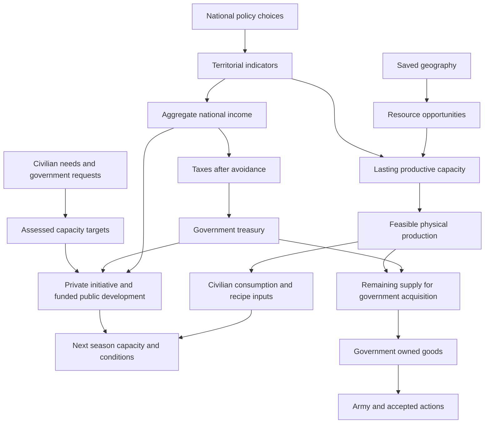

# Indicator economy replacement plan

2026-10-03. Planning requested by the user after the isolated indicator trials and agreement on productive capacity and goods allocation. The user subsequently authorized proceeding directly into implementation without further confirmation. Implementation and the authorized local fresh-game cutover are complete. See [results, verification and remaining balance work](indicator-economy-replacement-results.md). The pre-replacement checkpoint is `d7604c5`.

Replace the confusing civilian cash simulation with one policy-driven economy. Territorial indicators generate prosperity and taxable income; geography and lasting capacity produce physical goods. Keep the generic catalogues, map, seasonal history and useful interface. Remove the displaced calculations rather than maintaining two economic engines.

## The agreed starting rules

- A peaceful founding country should develop under unchanged reasonable policies. Its initial population stays the same across founding profiles. Exact defaults remain balancing work in test games.
- Health, education, infrastructure, security and social conditions influence economic strength. Private dynamism affects attainable productivity and growth; funded public development works without strong private dynamism, with lower default efficiency.
- Taxes finance government activity. Tax pressure, crime and unrest encourage informal activity even when the political system tolerates high taxes.
- Capacity is an aggregate ability to produce units per season, not a list of factories. Geography provides opportunity; demand provides a reason to expand.
- Development policies fund a share of assessed need. Construction tapers near its target; a temporary demand drop idles capacity rather than destroying it.
- Ordinary civilian needs and their industrial inputs receive supply before new government acquisitions. Government stock is distinct from national output under every ownership arrangement.
- Normal resource maintenance belongs in ordinary operating costs. Do not recreate a separate equipment-replacement procurement puzzle.

The [trial results](economy-baseline-experiment.md) support the indicator mechanisms, not the complete goods connection. All current coefficients remain provisional. The remaining founding-budget sensitivity is a balance backlog item, not a demand to freeze every percentage before implementation.

## One economic loop



There is **one aggregate income source**. Do not add wages, profits, government procurement or public sales to it again. Income is a measurement of activity, not a simulated household wallet.

National supply is a seasonal flow. It is not a hidden government reserve or a second persistent stockpile. Spare productive ability stays available for future customers.

## Proposed calculation contracts

These are implementation recommendations that make the agreed direction concrete. They supersede the separate public-inventory assumptions in the older alternative documents.

**Indicators and income.** Implement economic strength, health, education, dynamism, crime, inequality, infrastructure and environment, plus unrest and informal activity. Loyalty remains distinct. Use bounded, gradual targets; report inequality as an index, not a statistically exact Gini coefficient. Sum territorial population × configured reference income × economic strength to obtain national income. Aggregate social indicators by population. Shortages affect next-season conditions, not a second retroactive income calculation.

**Public and private development.** Use one installed-capacity pool per territory and resource. The ownership policy determines the balance of private initiative and public funding, rather than creating two accounting engines. Changing ownership changes future stimulus; it does not conjure goods or erase capacity. Allocate one abstract private reinvestment budget across resource expansion and private infrastructure; do not reuse the whole budget independently for every resource. Public development is limited by actual funded expenditure and the configured investment efficiency. New assets become usable next season.

**Capacity targets.** Calculate ordinary demand from population and optional prosperity response, then propagate recipe inputs. Add affordable government demand. Translate that demand into desired capacity using normal operating conditions, bounded by geographic potential and available labor. Do not repeatedly enlarge the target merely because current output is suppressed by missing inputs or damaged infrastructure. Persistent military acquisition choices can provide demand; cancelled or unfunded orders cannot drive unlimited expansion. Existing capacity survives falling targets; expansion stops when there is no remaining gap.

**Production and allocation.** Resolve the civilian demand class and its recipe inputs first, then government requests and their inputs. Share the same physical resources and territorial worker budget across all outputs and construction. Validate recipe references and reject cycles. Plan feasible deliveries before charging money; a government order that cannot be funded must not consume inputs needed by civilians. Use declared priorities and deterministic tie handling, not incidental database order. No unsupported resource-name exceptions.

Civilian provision is an abstract physical-needs allocation; it does not require household cash balances or an additional purchase payment. After-tax income informs private development and the disposable-income estimate, not a second consumer wallet. Report that estimate honestly; no individual income distribution is simulated.

Domestic supply is pooled across the nation's territories. There is no new internal transport network or shipping simulation in this pass.

**Government acquisition and operating costs.** Proposed simplification: charge one configured cost per delivered unit under all ownership arrangements. It represents a purchase or a funded public allocation; it is not a transfer to a second government account. Ordinary national production and maintenance are abstracted in the production baseline and resource operating rules. Do not also charge a separate treasury bill for the entire public output, then charge again for acquiring those same goods. Public expansion and social programmes remain genuine government expenses, distinct from acquisition. There are no public sales receipts from automatic civilian consumption. Prove this abstraction with worked public/private/mixed seasons before schema cutover.

For the first release, use game-owned reference prices. Keep the price provider separable so market conditions can replace it later. International trade, price clearing, shipping and blockade mechanics are outside this replacement.

Do not leave unused operating-cost parameters behind: every retained resource rule must name its consumer. Recipe inputs and labor constrain production physically; the configured acquisition price includes ordinary running costs for the delivered government goods. It does not trigger a second wage or maintenance payment.

**Stocks and military.** Preserve government treasury and owned goods. Accepted deployments and orders reserve opening owned resources; pending production or purchases never make an action immediately affordable. Military recurring goods needs participate in government demand, with existing stock used before fresh acquisitions. Explicit emergency reserve release can cover civilian nutrition shortages and reduces government stock without inventing sale income. Grants remain explicit transfers of owned goods or money. Normal resource upkeep no longer buys equipment; recruitment occupancy and military cash costs remain catalogue-driven.

**Finance.** Preserve treasury use before borrowing, credit limits, interest, default episodes, early warnings, the reserve policy and manual/automatic debt repayment. Replace the simulated lender cash account with the existing abstract credit rules; borrowing increases both treasury and debt and is reported as financing, not income. Reactive Guard spending remains a real government debit, but does not create household wages or a second tax receipt. Income support is government spending with a social effect, not additional earned national income.

**Damage and maintenance.** Keep resource operating requirements simple and automatic. Temporary idling or a single annexation season with unavailable labor must not delete capacity. Only explicit damage or sustained, defined neglect may reduce productive assets. Do not introduce a new combat-damage model in this package; connect existing damage where available and document any unimplemented future damage mechanism. Infrastructure retains its own funded maintenance and development taper, with those costs reported separately.

## Seasonal order and reconciliation

1. Read opening territory state, owned stock, debt, policies and accepted commitments. Apply pending national choices at the seasonal boundary.
2. Calculate aggregate income and same-season tax avoidance from opening conditions. Record taxes once.
3. Assess social programmes, infrastructure, development, government acquisitions and military commitments. Reserve accepted opening actions before optional expenditure; use treasury and receipts before credit. Keep funding priority explicit and configurable.
4. Resolve production recipes and the ordinary demand class. Allocate remaining supply to affordable government deliveries. Consume opening government stocks only for explicit commitments, release or upkeep.
5. Pay actual funded programmes, acquisitions, military costs and interest once. Make shortfalls visible by cause. Apply new development and indicator changes to closing state, usable next season.
6. Repay debt from eligible closing cash after protecting the configured reserve. Record results and persist one closing seasonal snapshot under the existing game transaction.

Package A must fix the exact priority list and rounding order in fixtures. It must not rely on an iterative household-cash market or repeated seasonal tax collection. Preview and settlement call this same resolver with the same opening inputs.

Two independent identities must hold:

```text
Closing treasury = opening treasury + taxes + explicit cash transfers + borrowing
                   − actual government spending − paid interest − principal repayments

Closing government goods = opening goods + delivered acquisitions + received grants
                           − releases − grants sent − action and upkeep consumption
```

Each physical production recipe also reconciles input consumption and output. There is no claim that abstract national income equals a conserved stock of simulated money.

## Database and authoring changes

Use the existing storage rather than adding a parallel economy schema. The representation below is proposed; exact indexes and JSON validation are implementation details.

| Storage | Planned change |
| --- | --- |
| `games.economy_rules` | Store validated per-game indicator coefficients, programme requirements, growth, efficiency, funding priorities and credit settings. Copy initial values at game creation; later template edits do not alter existing games. |
| Policy tables | Keep game-owned definitions, options, effects, parameters and conditions. Add supported programme/indicator effect handlers with explicit units and composition rules. Exclusive ownership/tax settings remain exclusive; only declared target contributions may combine. |
| Resource tables | Keep identities, roles, geography bindings, unit costs, recipes, demand and capacity rules. Add prosperity-sensitive demand and revise operating/founding fields. Remove wage payout, private inventory valuation and compulsory equipment upkeep contracts. |
| `territory_details.economy_state` | Store the full indicator set and only additional state actually consumed by the resolver. Geography remains static outside turn history. |
| `territory_production_states` | Retain durable capacity; simplify identity to turn × territory × resource, removing `owner_kind`. Ownership stimulus comes from policy settings. |
| `nation_resource_stockpiles` | Government treasury/goods only. Remove `owner_kind` and `cost_basis`; update unique indexes, queries, grants and debit helpers together. Recruitment remains derived capacity. |
| `nation_economic_accounts` | Drop the household/producer cash table. Remove civilian founding cash and lender-cash initialization. |
| `nation_resource_acquisitions` | Preserve requested quantities, spending limits and priority as seasonal intent. An intent is not payment or owned goods. |
| Nation state and reports | Keep debt/fiscal state and actual seasonal reports. Replace wage/profit/account fields with income, provision, capacity, demand, delivery, spending and causes of shortfalls. No new duplicate history table is needed. |

Policy strengths/defaults remain DB-authored. The new model coefficients must also be editable through validated test-game rule export/import, using `games.economy_rules`; they must not remain scattered constants. Start with primitive commands, not a new administration UI. Supported mechanisms still require code once; records cannot contain arbitrary executable formulas. Admin edits remain deliberately rough and do not replay elapsed seasons or require immutable definition versions. Rollback/adjust/retry remains the test workflow. Definitions are not copied every turn.

Use the existing stock catalogue, including household goods where configured. Remove equipment demand created solely by the retired upkeep system; retain an equipment definition only where it has an actual remaining consumer. Do not invent a new consumer merely to keep an obsolete resource active. Copper, services and new industry families remain later catalogue additions.

## Delivery packages

| Package | Work and evidence required |
| --- | --- |
| **A — Rules and worked seasons** | Define validated indicator/programme/capacity contracts and one pure resolver. Extract reusable recipe/quantity helpers from account-dependent classes. Prove public/private/mixed income, allocation, acquisition cost, reserve release, finance and funding priorities with small executable fixtures. No live change. |
| **B — Generic goods and development proof** | Add civilian/prosperity demand, recipe allocation, capacity targets, automatic taper and next-season growth. Run at least 80 fixed-policy seasons on saved ordinary and fertile geography with equal founding populations. Test shortages, worker/input bottlenecks, damaged infrastructure, a modest army, renamed nutrition and a synthetic additional resource. Extend the existing research harness; do not build another UI lab. |
| **C — Database and lifecycle replacement** | Prepare the fresh-game schema change and update input/state adapters, founding, neutral assets, capture, policy compilation, treasury, grants, deployment, Guard and rollback. Retire old accounts/resolvers and account-dependent rules/tests. Connect one authoritative forecast/settlement path. Verify in an isolated database before a live cutover. |
| **D — Existing interface integration** | Adapt payloads and consumers together. Keep Budget & Policies layout, visible treasury change/actions, colours, click-only help, graph enlargement, acquisition planner and real map layers. Remove obsolete household wallets, wage/profit/public-sales rows and equipment-upkeep warnings. Reuse recorded history for true income, capacity, utilization, shortages and expenditure graphs. No new layout design or invented profit estimates. |
| **E — Fresh-game playtest and balance** | Perform one reviewed cutover after C and D are complete. Run passive and player-controlled seasons, acquisitions, army upkeep, annexation and rollback/replay. Tune founding defaults and policy/rule values in the actual game. Record balance problems rather than adding rescue exceptions. |

Dependency: **A → B → C → D → E**. Packages C and D form one deployable replacement: do not run new schema with old field consumers, and do not deploy a transitional dual economy. A and B are proofs of the new implementation, not a second selectable runtime. A failed proof can be revised without destructive live changes.

## Current code affected

Source inspected when preparing this plan:

| Area | Required work |
| --- | --- |
| `ProductionEconomySeason`, `ProductionEconomyInput`, `EconomyService` | Replace cash-driven wages/profits and fiscal counterparty plumbing with the agreed model; retain one service entry point. |
| `ProductionAccounts`, `CivilianProduction`, `PublicIndustrySupply`, `CivilianEconomySeason` | Extract genuinely reusable physical helpers, then remove retired runtime code and callers. `ResourceRuleRegistry` currently calls `CivilianProduction::order`; move that graph validation before deleting the class. |
| `ProductionStateStore`, `ResourceCatalogue`, `ResourceLedger`, `NationResourceStockpile` | Update state copying, snapshots, founding and government-only availability. Remove cost-basis and private-account assumptions. Keep exact decimal money/goods arithmetic. |
| `Game`, `Nation`, `TerritoryDetail`, `FinanceService`, `GuardAllocator`, `AdminGameService` | Keep turn locking and rollback; update fiscal/action debits and deletion references. Neutral capacity persists through annexation; founding development is applied only once. Retain recruitment/loyalty behavior without introducing a full employment model. |
| `IndustryHistory`, `EconomicHistoryService`, `historySeries.js`, `CivilianEconomyView` | Replace retired financial series with recorded resource capacity, actual output, unmet demand, development and genuine government expenditure. Keep reusable charts and history transport. |
| `EconomyPanel`, header, planner, rankings, resource/map projections | Consume the new authoritative payload; update misleading labels, EN/FR text and supported effect controls. Keep scroll, focus, pending/saved/actual distinctions and truthful data availability. |

Update the automated test runner and fixtures along with removal. Do not leave obsolete accounting tests or disabled compatibility branches as the apparent specification. Passive AI remains Ready-only; strategic AI is not part of this work.

## Cutover scope

No old-save conversion, runtime feature switch, ledger bridge or reinterpretation of old financial history. Prepare one forward migration against empty game data. Do not rewrite already-applied migrations.

At the eventual cutover, delete disposable games through `AdminGameService::lifecycle`, preserving accounts, site configuration, saved map definitions/features/resource profiles, map drafts and source assets. Game-owned catalogues/history disappear with those games; reusable templates are deliberately revised for fresh games. Update restrictive-FK/index deletion order before applying the migration.

**Do not use `game:reset-worlds` for this scope:** `WorldResetService` also removes saved map definitions, drafts and catalogue templates. Provide the concrete game-deletion inventory and migration procedure when deployment is requested. No deletion or migration is part of preparing this plan.

## Acceptance and remaining balance work

- One income calculation, one government budget, one physical allocator and one authoritative forecast/settlement path. No dormant old resolver behind a flag.
- No duplicated tax, output, procurement charge, private development budget or government stock. Debt and treasury reconcile independently; money spent on goods is not additional national income.
- Public high-tax and private low-tax countries can develop under documented ordinary conditions. An ordinary peaceful mixed start funds its defaults without continual intervention; extreme policy/map choices can fail.
- New capacity is paid/allocated and usable next season. Demand falling stops expansion, not asset persistence. Missing inputs do not trigger endless overbuilding.
- Government acquisitions cannot bypass civilian priority, take unavailable goods or make already accepted actions retroactively affordable. Generic recipe and renamed-resource fixtures prove the allocation rules.
- Prove at least three passive seasons and rollback/replay in an isolated real-game database. Include acquisitions, grants, manual repayment, Guard spending and territorial ownership changes; do not claim full combat replay determinism.
- Retained UI loads with accurate graphs/layers, stable edits and scroll, and actual/saved/draft forecasts. Unsupported economic layers remain unavailable, never filled with illustrative data.
- Balance constants remain editable. The trial's 49 checks do not prove the new goods allocation or schema. Keep the recorded founding sensitivities, high-tax revenue tradeoffs, infrastructure return and army affordability on the playtest list.

Packages **A–E** are implemented; the next task is fresh-game player balance testing. Detailed constitution wizard, provincial budgets, migration, urban visuals, trade routes, price markets and additional resources remain future work. This replacement does not silently approve or cancel those earlier ambitions.

## References

[Current experiment and limits](economy-baseline-experiment.md) · [NO2 review](no2-economic-feedback-review.md) · [Policy foundation](policy-system-foundation.md) · [Resource foundation](resource-system-first-pass.md) · [Current production lifecycle](production-lifecycle-contract.md).

The older [indicator alternative](indicator-economy-alternative.md) and [overview](aggregate-economy-alternative-overview.md) remain historical proposals. This plan takes precedence for the replacement scope, shared capacity/supply, acquisition abstraction and phased implementation. Their older packages and public/private accounting boundaries are not automatically adopted.
