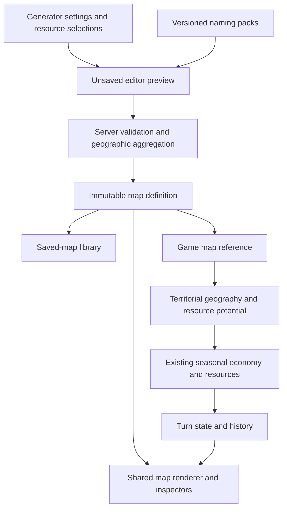

# Persistent microcell geography and map workspace — implementation plan

Date: 2026-09-28

Status: first implementation delivered in the workspace and verified in isolated environments. Live reset/migration remain pending deployment limits. See [results, limits and rollout](map-v2-implementation-results.md).

## Objective

Make the Map Lab's proven geography usable by the real game: configurable region dimensions and microcell resolution, complete saved geography, named features, coastal measurements and configurable natural-resource distribution. Deliver the associated map workspace and integrate the resulting maps into every game map view. Finish with a deliberate reset of disposable game and saved-map data and start fresh.

This is the geographic foundation for later economics and population systems. It does not implement microcell population, cities, migration, provinces, ports, trade routes or new combat rules. Existing policy, seasonal economy, resource catalogue and passive-player foundations remain the runtime to connect to.

The accepted product decisions below are settled. Table names and package details are engineering proposals that can be refined during implementation without reopening those decisions.

## 1. Agreed world contract

| Subject | Contract |
| --- | --- |
| Dimensions | Positive integer region columns and rows, initially defaulting to 30 × 20. A 40 × 30 world is an ordinary supported configuration. Limits are deployment settings based on measured memory, payload and processing costs, not a permanent 600-territory rule. |
| Resolution | Uniform 7, 19 or 37 microcells per region. More microcells add detail; they do not increase the nominal area or resources of a region. |
| World identity | Dimensions, resolution and sampled geography become immutable when saved. Editing produces a new saved map. An active game's map cannot be resized. |
| Persistence | Save actual sampled results and their provenance, not just a seed. Generator or naming-pack changes do not alter existing worlds. |
| Territories | A game territory corresponds to a region and aggregates its microcells. Ownership, armies, population and seasonal economic state remain territorial for this release. |
| Geography | Static map data is outside seasonal history. Turn rollback restores game state against the same map. |
| Resources | The map explicitly selects geographically meaningful resources under their real identities. Generic Ore excludes Iron and Copper; Iron and Copper can coexist. No conversion between these resources. |
| Compatibility | Previous games and saved-map formats are disposable. Replace the runtime and delete retired paths; do not build old-save readers, adapters or conversions. |

Use distinct names for `regionColumns`/`regionRows` and canvas/world-coordinate extents. A large host can raise operational limits; a 300 × 200 world is an architectural scaling example, not a performance promise. At 37 cells per region it contains 2,220,000 microcells. The editor must show these counts before generation and reject requests above the configured limits clearly.

Changing resolution can alter sampled coastlines and small features. Preserve area and quantity semantics; do not promise identical geography or deposits at different resolutions.

## 2. Starting point and replacement boundaries

The real game already saves generated geography and uses shared map rendering. This is an extension and replacement of that contract, not importing the laboratory application into gameplay.

| Existing area | Work required |
| --- | --- |
| `resources/js/map/model.js`, `geography.js`, `app/Domain/MapData.php` | Remove fixed world dimensions from geometry, bounds, generation coordinates and callers. |
| `resources/js/map/snapshot.js`, `app/Domain/GeneratedMapData.php` | Replace `hex-beta-1` and its fixed 600 regions / 11,400 cells with a complete versioned contract and authoritative validation. |
| `resources/js/map-lab/biomes.js`, `coasts.js`, `cartography.js`, `natural-resources.js` | Extract useful geography into shared map modules; exclude laboratory nations, armies, development and economic fixtures. |
| `resources/js/map-lab/terrain-v2.js`, `terrain-v2-field.js`, `water-visuals.js`, `coastal-landscape.js` | Integrate the proven terrain, water-depth and coastal appearance with bounded rendering caches. |
| `GameMap`, `MapDraft`, map creation/read services | Replace partial snapshot persistence and connect the new immutable geographic record. |
| `MapStudio`, `GeographyPreview`, in-game map components | Extend the existing editor; use the same restored map model in preview, gameplay, entry, minimap and ownership comparison. |
| Territorial resource production | Replace dominant-terrain-only potential with aggregates from saved microcell geography through the catalogue's supported rules. |

The lab already has close-up water-depth rendering. The integration must preserve the depth inputs and verify the overview/close-up transition; it should not create a second independent water renderer.

## 3. Static geographic data to preserve

Define field names, units, valid ranges and missing-value meanings in one format specification before extending the codec. Explicitly distinguish physical measures from generator indices: current temperature, rainfall and moisture values must not be presented as degrees Celsius or millimetres unless a conversion is actually defined.

| Data group | Saved information |
| --- | --- |
| World | Dimensions, resolution, nominal region area, seed, generation settings, format/generator/profile versions and content fingerprint. |
| Regions and cells | Stable map-local IDs, region coordinates, microcell coordinates, membership, area weight and topology needed for reconstruction. |
| Ground and climate | Base/ground elevation, slope, latitude, temperature, precipitation, moisture, terrain, landform, biome, vegetation and baseline snow/ice. Desert is a biome distinction, not a replacement for relief. |
| Hydrology | Ocean/lake classification, water surface elevation and depth, drainage basins, downstream connectivity, river courses/edges and flow measures. Preserve hydrological nodes separately if the generator uses vertices rather than cells. |
| Coasts | Land-water edge identity and geometry, adjoining water body, shore rise, inland approach, ground conditions, exposure and accessibility measures, including unknown or map-boundary-limited estimates. |
| Features | Stable feature identity, type, saved name, geometry/membership, label anchor and relations to other features. |
| Resources | Selected resource identities, frozen generation profiles/settings and generated abundance/density/quantity/quality fields as applicable. |
| Agricultural suitability | Explicit baseline suitability and its contributing factors, distinct from farmland, investment, cultivated area and current food output. |

Persist semantic river/coast identities, not merely drawing segments. Lake depth is relative to the lake surface, not sea level. Store measurements used to derive access scores so that the inspector can explain them. Coastal access remains geographic information; no amphibious permission, port capacity, current or wind simulation is implied.

Territorial aggregates include land/water fractions, terrain/biome composition, meaningful land-weighted climate summaries, agricultural potential and per-resource potential. Use sufficient precision for small islands. Average only meaningful values; do not average water with farmland suitability or sum cell percentages as quantities.

Keep the existing distinction between geographic aggregation and military connectivity: all constituent land contributes to potential, while disconnected islands must not create a fictitious ground connection between armies. Server-derived adjacency and valid connected homeland groups remain required.

## 4. Persistence proposal

Use one immutable static map definition, referenced by the saved-map library and by games. A saved map can be reused without acquiring shared seasonal state. Saving an edited version creates another definition; deleting a library entry cannot delete geography still referenced by a game.

Recommended storage boundary:

| Record | Responsibility |
| --- | --- |
| `map_definitions` | Dimensions, resolution, format/provenance and fingerprint; canonical geographic payload containing cells, edges, hydrology and aggregate inputs. Start with the existing document-style storage approach, extended to the complete contract. |
| `map_features` | One static row per named feature, with stable map-local key, type, name, anchor, membership/geometry and relations. Structured fields may use JSON; do not create a row per character or per visual fragment. |
| `map_resource_profiles` | Map-owned snapshot of selected geographic resource identities, generation parameters and applicable exclusion/eligibility rules. |
| Geographic payload | Generated resource fields keyed to those selected profiles, agricultural suitability and other cell/edge data. No seasonal stockpiles. |
| Existing library/game records | References to the immutable map definition. Game-owned economic definitions and seasonal state retain their existing lifecycle. |

This avoids requiring millions of ORM cell objects merely to save a large map. Bulk serialization, payload limits and memory must still be measured. Introduce chunked storage/transport only if those measurements require it; do not promise arbitrary map sizes from a single JSON response.

There must be one authoritative representation of each field. Feature names belong to feature rows; the transport snapshot assembles them with the geographic payload. Do not maintain independently editable copies in JSON and tables. Include feature/profile contents in the complete map fingerprint. Derived aggregate caches must be reproducible and versioned, with server validation at import/save.



The map's resource profile and the game's resource definition serve different purposes. Join by validated stable resource identity, not labels, row IDs from another game or an alias such as “any metal.” A matching key must also have compatible quantity/unit semantics. A game can ignore additional resources on a map. A geographically dependent rule that requires an unselected resource is incompatible and must be reported before creation. A selected resource with intentionally zero abundance is a valid scarcity configuration, not a missing definition.

## 5. Named geography and naming packs

First supported named feature types: oceans/seas, continents, islands, rivers, lakes, bays and mountain ranges. Retain extensibility for plains and forests without making every possible feature detector a release requirement.

One river has one feature identity across territories; tributaries may have their own identity and a relation to the receiving river. Features can overlap, and membership can cross region boundaries. Bays belong to a water body; islands and continents have consistent land-component relationships. A detector may find no defensible bay on a particular map: do not manufacture one to fill a list.

Move hardcoded name vocabulary into validated JSON packs: pack ID/version, cultural source, display language, and feature-type-specific complete names or compositional patterns. Start with fictional English names. Culture and UI language are distinct: switching the interface to French must not rename the world.

Use deterministic selection with map-local collision handling and a readable fallback. Persist the chosen names. Regenerating names is an explicit preview action; updating a pack does not rename saved maps. Allow a simple selected-feature rename before saving. Geographic cultural influence seeds, nation-specific terminology and elaborate naming tools remain later extensions.

## 6. Natural resources and geographic production

Only geographically meaningful resources have map-generation profiles. Money, recruitment capacity and future services do not create deposits. Food uses agricultural suitability; timber uses forest conditions; minerals use deposits. These can share profile infrastructure without pretending they have identical generation rules.

Profiles use supported generation methods with validated parameters. The initial methods cover agricultural suitability, forest potential and deposit fields. New resources can reuse these methods; a genuinely new mechanism still requires code.

Expose, where meaningful:

- Eligibility: land, lake or sea; depth/elevation bounds and exclusions.
- Affinities: terrain, relief, climate, moisture and other existing geographic factors.
- Abundance: how prevalent the resource is.
- Concentration: broad distribution versus clustered deposits.
- Richness: quantity or potential within suitable locations.

Keep exclusion groups in definitions. Selecting Ore prevents simultaneous Iron/Copper selections and explains why; changing the selection requires an explicit user action. Never relabel or combine deposits. Default selections must fit the current game's resource template. Optional laboratory minerals do not silently become new playable goods or acquire invented military costs.

Replace fixed-size distribution anchors with world-relative placement and account for region area. Changing microcell resolution must not multiply reserves or output. Preserve distinct meanings for density, deposit quantity and production capacity; the laboratory's illustrative numbers are starting inputs, not a balanced economic contract.

Agricultural suitability initially combines existing climate, moisture, slope and water access. Specify how drought, excessive wetness, cold and steep terrain constrain it. Forest cover and usable land must remain visible so that “fertile” does not silently mean “already cleared and cultivated.” No soil depletion, irrigation network or crop simulation in this release.

Connect territory aggregates to the existing catalogue production handlers. Food should respond to usable agricultural potential; extraction should respond to the correct saved resource. Include a bounded geographic capacity so a tiny deposit does not make an entire territory's workforce equally productive. Keep forecast and seasonal settlement on the same server calculation. No second money settlement, new employment engine, automatic factories, resource markets or balancing campaign.

Baseline deposits remain static in this phase. Do not subtract extraction from the immutable map. Finite depletion, regrowth and extraction investment will require separate game/turn state later; the data model must leave that extension possible without implementing it now.

## 7. Updated map workspace

Extend the existing administration Map workspace and shared standalone generator. Do not build a separate editor application.

Each setting category has its own small retained panel instance: World, Terrain, Climate, Water & coasts, Resources, Names and Layers. Select them through icon tabs in the left sidebar. The right inspection sidebar collapses independently. This is the user's latest clarification, superseding the earlier simultaneous-visible-panels arrangement.

```text
Saved map library (disclosure)        Map name / Save / Start game
---------------------------------------------------------------------
[Icon tabs] [Selected category]       Map canvas       [Inspector ▾]
                                     Zoom and fit
---------------------------------------------------------------------
Dimensions • resolution • total cells • changed/ready/saved • errors
```

One workspace draft owns settings and the generated preview. Closing a panel does not discard its values; reopening it restores its view. Updating one category must not remount unrelated panels or disturb their focus, scroll or unsaved input. Panel instances do not own independent map copies or submit their own game-creation requests. Generate, Save and Start game remain workspace actions. This composition leaves categories easy to extend or rearrange without coupling their implementations; it does not require a new docking/window-management framework.

Narrow layouts show one selected panel at a time while retaining the same values. Existing native controls, FieldShell, RangeField, Button, Panel and dialogs remain the foundation. Use semantic theme tokens, EN/FR interface text, keyboard labels, visible focus and text equivalents for canvas-only information.

**World:** region columns/rows, 7/19/37 resolution, seed and cell count before generation. Show deployment limits and actionable validation. Distinguish numeric world dimensions from rendering scale.

**Terrain, Climate and Water & coasts:** separate panel instances retain useful current controls and expose the integrated desert/coast settings under the appropriate owner. Group advanced settings within their category rather than presenting every generator coefficient at once.

**Resources:** explicit available-resource selections, exclusion explanations and per-resource sliders with exact numeric inputs. Show total generated quantity/coverage and the relevant overlay. A control that does not apply to a resource is absent or clearly unavailable, not a fake universal knob.

**Names:** naming pack, generate names, feature search/list and selected-feature name editing. Feature selection highlights the complete river, lake, bay or range across region boundaries.

**Layers and inspector:** terrain/relief, water depth, climate, drainage, named features, coastal accessibility, agricultural suitability and selected resources. Keep one primary analysis overlay with its legend, plus independently useful outlines/labels. Inspect an individual coastal edge when a cell has several different shores. Label approximate scores as such.

**State and actions:** distinguish unsaved settings, generated preview and saved map. Dimension/resolution/terrain changes require full regeneration. Resource-only changes regenerate resources against unchanged geography; name-only changes preserve geography and deposits. No game may start from a preview whose settings are newer than its generated results. Reopening a saved map restores its exact contents; editing saves a new map version.

Generation should run off the main interaction path, preferably using the existing pure modules in a worker. Support cancellation or discarding stale results with a generation ID. Show actual stages/counts rather than an invented time estimate. Cancelled generation and failed saving must leave the last usable preview intact. Follow existing command reconciliation on uncertain network outcomes; do not blindly retry game creation.

Starting a game validates resource-template compatibility and available homeland groups, then uses the saved map definition atomically. Active-game administration inspects that map rather than mutating its geography beneath turn history.

## 8. Rendering and client ownership

Extract shared generator/renderer modules; the lab continues as an independent consumer for experiments. Do not import its demo economy, population or army fixtures into production.

Use one restored geographic model across the game, homeland selection, administration preview, minimap and ownership comparison. Verify water depth and coastal detail through zoom, including elevated lakes, river joins, snow/ice and desert transitions. Names need zoom-sensitive priority and overlap handling so a world overview stays readable.

GameDataService remains the owner of confirmed game reads. Static geography is cached by map identity/fingerprint and reused across turns; ownership, units and economic overlays come from the current game snapshot. Geography is not reloaded by each panel or every season. Keep editor preview state separate from authoritative game state inside the existing workspace lifecycle; no second confirmed-data store.

Fit-to-world, hit testing, camera bounds, chunk caches and minimaps must derive dimensions from the loaded map. Bound cached canvas memory, release resources on map changes/unmount and fence asynchronous responses when switching games. Large worlds need viewport culling; a larger server alone does not fix browser memory or whole-world rasterization.

## 9. Delivery packages and exit checks

Implement sequentially, keeping each package reviewable. Packages A–D are not independent releases of a partly converted production runtime. Validate them in fixtures and isolated databases until the complete fresh-game path is ready.

### A — World geometry and complete format

- Specify the format, IDs, units, dimensions, resolution and area rules.
- Parameterize shared generation, geography extents, climate coordinates and resource anchors; audit fixed dimensions throughout PHP, JavaScript, fixtures and UI.
- Implement the new codec and server validation, including limits, unique IDs, membership, finite ranges, topology and references.
- Establish immutable persistence and server-derived territory geography. Remove the old-format reader when callers switch.

Exit: round-trip 30 × 20 and 40 × 30 at all three resolutions; reject malformed geometry and excessive payloads; verify area conservation on controlled fixtures, reciprocal connections and homeland validation. Record payload size, generation time and memory for these cases. Measure one larger case before choosing deployment defaults; do not hardcode the largest test as a permanent game rule.

### B — Geography, named features and visual integration

- Extract shared biome, hydrology, coast and feature detection from the lab.
- Persist the full field inventory, feature relationships and names; add the English naming pack and inspector projections.
- Integrate Terrain V2, depth and coastal visuals into the production map lifecycle.

Exit: exact saved/restored geographic values; river continuity, elevated-lake depth, feature membership and per-edge coastal measurements survive reload. Names remain stable after a naming-pack change. Compare overview and close-up renders, including water depth, and confirm no laboratory fixtures enter saved maps.

### C — Resource profiles and territorial connection

- Add selectable generation profiles, data-defined exclusions, distribution controls and saved results.
- Define agricultural suitability and area-normalized territorial aggregates.
- Connect matching geographic potential/capacity to current catalogue production and preview. Validate map/ruleset compatibility before creation.

Exit: Ore versus Iron/Copper exclusions work in both selection directions; missing profiles differ from intentional zero abundance; an unused selected resource does not alter unrelated production. Synthetic resources using an existing supported method need no hardcoded identity branch. Controlled fixtures show no resolution-driven multiplication, wrong-resource extraction or unlimited output from negligible suitable area. Forecast and actual season agree.

### D — Map workspace and all game callers

- Deliver the workspace described above using independent category panel instances, shared components and client services.
- Update library save/load, game creation, entry, World, minimap, comparison and administration to the new contract.
- Update contracts, fixtures and obsolete tests; delete retired paths and cached-setting keys rather than adapting old presets.

Exit: generate → inspect → save → reopen → create game → found nation works in the browser. Test current dimensions and a custom rectangular world, each resolution, stale-generation handling, save failure, template incompatibility, EN/FR and narrow layout. Switching games cannot retain the previous map or overlay. A names/resources-only edit respects its regeneration boundary.

Panel acceptance: use left-sidebar icon tabs for each independent category instance. Switch Resources → Climate → Resources without losing values, focus history or panel scroll; show one selected category at a time. Keep the right inspector independently collapsible. The preview and workspace draft remain shared; closing the workspace disposes every panel subscription/listener.

### E — Fresh-game release and destructive reset

Prepare the reset only after A–D and the complete game journey pass in an isolated database. This step supersedes the earlier decision to preserve saved maps during the resource rollout.

Reset scope:

| Remove | Retain |
| --- | --- |
| Every game, nation, territory, turn/history record, unit, order, battle, diplomacy record and participation/automation record | Source code, Map Lab experiments and source-controlled artwork/naming/template assets |
| Game-owned policy/resource sets, choices, effects/state, allocations, stockpiles, economic records and related commands/jobs | Account/login/admin access and unrelated site configuration; these are outside game/map data |
| Every previous saved map/library entry, snapshot, generated geographic record and disposable map artifact | Migration history needed for correct forward schema execution |
| Previous database-authored gameplay/map templates and presets; replace with current source defaults | Current source defaults used to seed the new version |
| Game/map-scoped cached results, stale command locks and obsolete browser map presets | Unrelated application data and unrelated workspace changes |

Implement an explicit reset command with a preview of its concrete table/asset scope, using the audited foreign-key/lifecycle dependencies. Do not rely on a guessed list of tables or run a whole-database wipe to remove game data. Delete only owned generated artifacts, never shared artwork. Bump client map-settings storage versions so old local presets do not repopulate the new editor.

For the actual deployment: stop game commands/turn automation, reset old domain data using a path compatible with the installed schema, apply forward replacement/cleanup migrations, seed current template defaults and reopen access after smoke checks. Derive the exact reset/migration ordering during implementation and rehearse it against the currently applied migration history as well as a fresh database. Editing an old migration alone is insufficient for a database that already ran it. Do not disable referential checks to hide orphaned data.

No old-map conversion, dual runtime or retained old-game support. The earlier resource-foundation code remains, but its disposable records are recreated. Planning this step does not execute it.

Exit: zero previous game/map/template records or dangling jobs; retained admin access works; a new generated map and game can be created; an old-format upload fails explicitly. Document the actual executed command and results when deployment occurs.

### F — Final playable verification and handoff

- Complete one default and one custom-dimension new-game browser journey, including resource displays, policy preview/save, deployment and normal commands.
- Run multiple seasons with passive players, then rollback and replay. Verify geography/features/deposits are unchanged, seasonal resources are restored and no static map copies accumulate per turn.
- Verify scoped deletion of one game and one library entry does not damage another game's referenced map or resource/policy definitions.
- Run the relevant geometry/codec, economic, lifecycle, client-contract and browser tests plus the build. Replace assertions tied only to retired behavior rather than adding compatibility branches to satisfy them.
- Record measured sizes/performance, screenshots of key map views, checks actually run and known limits. Update the current-game and map handoffs to describe the delivered runtime.

This incorporates the outstanding resource Package C browser/release review; it does not require polishing the obsolete map format first.

## 10. What remains deliberately outside this release

Microcell population and migration; emergent urbanization and industrial artwork driven by real development; provinces/development zones; cultural naming influence fields; map painting/terraforming; ports, naval routes, blockades and lake naval rules; new landing/combat rules; extraction depletion/regrowth simulation; hunger consequences; processed-goods chains and market pricing; strategic AI; old-save support.

The geographic fields and stable identities make these possible later. Their absence must not be filled with laboratory demo values presented as real game state.

## Immediate next assignment

Resolve the deployment memory/body-limit decision described in [implementation results](map-v2-implementation-results.md), then perform the rehearsed maintenance/reset/migration sequence and live smoke checks. Smaller editor omissions and remaining verification are listed there; do not reopen the agreed world contract.
