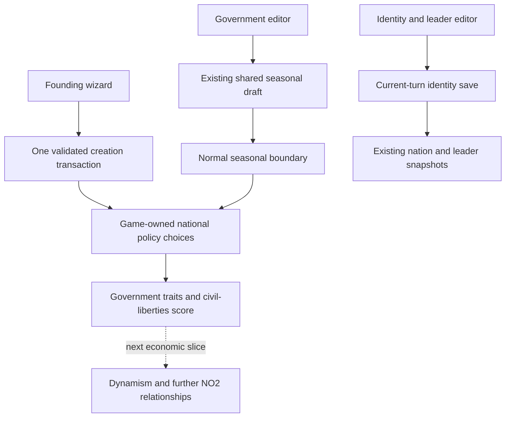

# Nation institutions and identity — first implementation plan

2026-10-04. **Planning only.** The user agreed to defining national institutions during creation and providing a dedicated in-game editor, including flag and leader. Revolution/amendment mechanics remain open for future playtests. This document does not authorize implementation, a live reset, catalogue edits or Git publication.

## Objective and scope

A player creates a country with an understandable government structure and explicit civil liberties, then can edit those institutions and the nation's identity during play. Institutions are real game-owned policy choices. This becomes the foundation for adding more NO2 economic relationships and service policies.

The first pass delivers creation, editing, validation, institutional summaries and a policy-derived civil-liberties score. **Connecting liberty to dynamism is the next economic slice, not an unannounced formula change in this one.** The current mixed economic starting recipe, population, productive capacity, resources and financial rules remain the baseline. Government form and economic ownership are separate concepts.

No revolution, constitutional-amendment procedure, consent simulation, political currency, transition penalty, election calendar or automatic overthrow. No leader skills/aging/succession simulation, provincial authority, new emblem system or nation-wide terminology dictionary. Existing custom names and leader titles remain editable. Nation colours retain their existing creation-only contract.

## Evidence from the current game and NO2

- `NationCreationProcess.js` currently has Identity, Leader, Homeland and Review. Its next-step limit assumes four steps and must become list-driven.
- `NationSetupService`, `EntryController::setup`, `CreateNationUiRequest`, `NationCreationService` and `NewNation::finishSetup` already form a shared transactional creation path. Policy defaults initialize before economy initialization.
- Policy definitions/options/effects are already game-owned. Current and pending choices, previews, conditions and seasonal history exist. No second constitution settings table is justified for the same choices.
- `GameplayService` owns a shared seasonal policy/acquisition draft. `PolicyService::submit` replaces the entire pending policy package; an editor that sends only its visible topics would erase other pending choices.
- `EconomyPanel::edit` currently reads all its controls into that shared draft. Adding another editing surface requires changing this to precise choice/parameter patches so stale hidden controls cannot overwrite the other surface.
- Nation and leader identity are already stored in seasonal details; flag recipes are stored but not included in the current owner editing payload. There is no delivered post-creation identity editor. Base `nations.name` and seasonal `nation_details.usual_name` must agree when names change and when a later season is rolled back.
- The flag composer, uploads, ImageField, FormField, FieldShell, Tabs, explicit Tooltip and permanent save/review patterns already exist. Reuse these boundaries.
- NO2 government reforms were packages of constitutional choices. The archive contains revolt-state remnants and a historical revolt comment, not evidence requiring a new revolution subsystem. See [the extracted reform packages](no2-policy-catalogue.md#reform-packages).

## Proposed founding choices

### Government step

Start with one game-authored **Government structure** policy whose named options act as profiles. Each supplies supported structural traits, rather than an arbitrary economy bonus:

| Initial profile | Player-facing meaning |
| --- | --- |
| Absolute monarchy | Hereditary ruler with concentrated authority |
| Constitutional monarchy | Hereditary head of state and elected parliamentary government |
| Parliamentary republic | Parliamentary government and a separate head of state |
| Presidential republic | Elected president and elected legislature |
| Authoritarian republic | Republican form with power held by a restricted leadership |
| Military government | Army-installed leadership with concentrated authority |

The limited trait vocabulary covers head-of-state selection, executive arrangement, representation and judicial independence. Exact combinations/descriptions are authored and validated during Package A. A new profile using supported traits is a catalogue change, not a new hardcoded government class. Editing each branch independently can come later.

Changing the government profile does **not** silently change civil liberties, taxes, ownership, service funding, flag or a custom leader title. For example, hereditary leadership does not itself decide press freedom.

### Civil liberties step

Four small policy topics, initially Protected / Restricted:

- Freedom of conscience and religion.
- Freedom of expression.
- Freedom of association.
- Freedom of the press.

These supply typed, bounded per-right values. An initial civil-liberties score combines the four contributions, normalized to 0–100%. Equal weighting is the proposed first recipe; contribution values belong to the game catalogue so balancing does not require changing UI code. The supported right vocabulary remains an engine concept.

This is a **national policy-derived measurement**, not another slowly evolving territorial economic indicator. Describe its limited four-right scope explicitly. Show the underlying choices alongside it. Government traits describe political structure separately; avoid inventing a comprehensive democracy score from these few inputs.

Rights do not yet introduce censorship of the game's news, protest commands, elections or legal-process simulation. Future policies can consume the supported settings and prerequisite engine when those mechanisms are actually introduced.

Proposed fresh-game defaults: parliamentary republic and protected liberties, retaining the existing mixed economic recipe. These are starting defaults, not a preferred victory condition or a claim that all profiles are already economically balanced.

### Wizard journey

**Identity → Government → Civil liberties → Leader → Homeland → Review**.

Use the same institutional field composition later in the in-game editor. Each new step needs only concise descriptions, click-only help and an easy default. The review lists the chosen structure, four liberties, identity, leader and homeland before one creation submission.

Replace the current unconditional `Empire of …` / `Emperor` fallbacks with neutral localized defaults when the player leaves optional fields blank. Explicit names/titles always win. Selecting a different government must not overwrite the player's roleplay text.

Validate the submitted founding choices against the game's own catalogue and edit counter. The setup read supplies the relevant catalogue subset; the browser does not invent authoritatively valid options. Catalogue changes during the wizard require refreshed choices and a clear review, not silent remapping.

## Dedicated in-game editor

Add **Government & Identity** alongside Nation's existing Overview and Demography & Development tabs. Within it, three compact sections/tabs:

| Section | Editable information | Proposed timing |
| --- | --- | --- |
| Institutions | Government structure and four civil liberties | Next seasonal boundary, using normal pending policies |
| Nation identity | Usual/formal name, flag upload, existing flag composition | Immediately on explicit save |
| Leader | Name, title and portrait of the displayed active leader | Immediately on explicit save |

Keep the active section's save/review actions above its scrolling content. Show current versus pending institutional choices. Identity and leader fields keep local drafts until explicit save; ordinary refresh does not erase typing or replace focused inputs. Changing a leader's displayed identity does not add an election, death or succession event.

Institutional changes use the existing shared policy package. Its review must disclose other unsaved budget/policy/acquisition changes that will be saved together, with links to the relevant screen. Do not hide this behind a button labelled as saving only government. Cancelling government edits should affect only those edits; discarding the whole seasonal package must be explicit.

Route constitution/civil-rights catalogue categories to this dedicated view. Existing economic ownership remains in Budget & Policies. Use a common presentation classification so a policy has one editing home and does not also appear accidentally in Budget's Other/Institutions groups. Unknown economic topics remain accessible through the existing fallback.

No special political procedure for institutional edits at this stage. Their normal save/turn history can later be wrapped in an amendment/revolution process if playtests justify it.

## Storage, authority and history

1. Add institutional options/effects to the game-owned policy catalogue. Extend the effect registry only with the small typed trait/right contracts actually consumed by the summary. Reject invalid trait values and contradictory authored profiles. Arbitrary formulas remain unsupported. Keep definitions separate from seasonal choices; no per-turn definition cloning.
2. Founding writes selected institutional choices immediately inside the existing creation transaction, before economy initialization. Other policy defaults remain game-defined. Both full-form and JSON callers use the same validation and initialization. A rejected submission leaves no partly initialized finished country.
3. In-game institutional choices reuse `nation_policy_pending_changes`, turn materialization and `policy_report`. Scores are derived from the applicable saved/preview choices; saving a pending choice does not change the current score or replay a season.
4. Identity commands mutate current `NationDetail` / `LeaderDetail`, preserving earlier snapshots. Update the base name used for uniqueness and lookup coherently. Rollback must restore base-name lookup from the reopened turn's identity; do not introduce an independent identity history table.
5. Media requests distinguish Keep / Replace / Remove. Recipe and corresponding PNG are committed together. Preserve assets still referenced by earlier snapshots. Clean only files generated by a failed invocation; do not unlink an older published flag/portrait prematurely. Reuse existing image limits and validators.
6. Publish editable owner identity/flag-recipe fields and institutional summaries through the existing owner snapshot, plus the public institutional summary where nation information is already public. Use GameplayService's command lane, authentication, context/revision checks and refresh reconciliation. No second confirmed-state store or automatic mutation retries.

Expected storage work is catalogue content plus existing detail fields; a new constitution table is unnecessary. Confirm any small missing authoring/read-model field during Package A. A separate schema change must have a concrete consumer, not be added for speculative future revolutions.

The implementation targets fresh games from the updated template. Do not add old-save conversion, silent backfills or compatibility bridges. This plan performs no reset; any development cutover should be explicit and limited to disposable game data, preserving accounts and map assets.

## Ordered implementation packages

### A — Institutional catalogue and founding contract

Define the government profile effects, four rights, validation and summaries. Seed the current game template; keep profile descriptions/contributions DB-authored through existing authoring tools. Expose creation choices/counter. Add validated founding choices to the shared creation transaction before economic initialization. Verify identical initial population and no accidental reset of economy/capacity when editing institutions later.

### B — Wizard and reusable fields

Add the two steps, remove four-step assumptions and extend field/error routing and final review. Extract the smallest institution-field composition for both consumers. Reuse the existing flag/portrait/text controls; move the flag dialog to a neutral shared location if needed rather than making gameplay depend on the creation feature. Keep focus, previews and private file drafts Scope-owned.

### C — In-game government and identity editing

Add the Nation section and current/pending summaries. Centralize precise option/parameter patching and shared package review/save so Budget and the new editor cannot overwrite each other's choices. Add owner-authorized identity/leader commands through GameMutation and the existing command lane. Reconcile identity in headers, map labels/flags, reports and current nation views; add the base-name rollback synchronization. Do not add elections or economic effects here.

### D — Verification, cleanup and handoff

Use isolated games and browser fixtures. Remove superseded duplicated field/save helpers once both consumers use the shared path. Update generated client definitions, UI/data catalogs and results. No live gameplay mutation is needed for verification.

Required evidence:

- Every government profile and liberties combination round-trips through creation and owner reads; malformed/outdated choices fail before final creation.
- Two games retain independent authored definitions. Template edits do not rewrite their policies.
- Budget edits survive government editing/save and vice versa; pending acquisitions are preserved and disclosed. Hidden invalid fields still block the whole package.
- Institutional save remains pending, applies once at the boundary and survives repeated seasons; rollback restores choices and summaries without duplicating effects or definitions.
- Rename uniqueness, formal name, leader title/name, portrait and flag Keep/Replace/Remove work with ownership and stale-context checks. Rejected/uncertain submissions retain drafts; no automatic retry.
- Historical identity/media remain intact. A later-season rollback restores name lookup, labels and identities coherently.
- Same-scope refresh preserves inputs, focus, tabs and scroll. Changed owner/game clears private drafts and files; repeated navigation releases owned resources.
- EN/FR, narrow layout, keyboard step navigation, explicit help, media editor focus return and permanently accessible save controls pass actual browser checks.
- Current economical reports and goods/treasury rules remain unchanged by this first slice.

## Next economic work, after this foundation

Use the explicit liberty input to restore a deliberate NO2-inspired dynamism relationship, with adjustable game coefficients and tests for private/mixed/public countries. Then expand named health, education, public-safety and welfare commitments; keep physical food support and monetary income support distinct. Freedom-related unrest/growth and press-based information access remain separate decisions, not hidden extras in this implementation.
