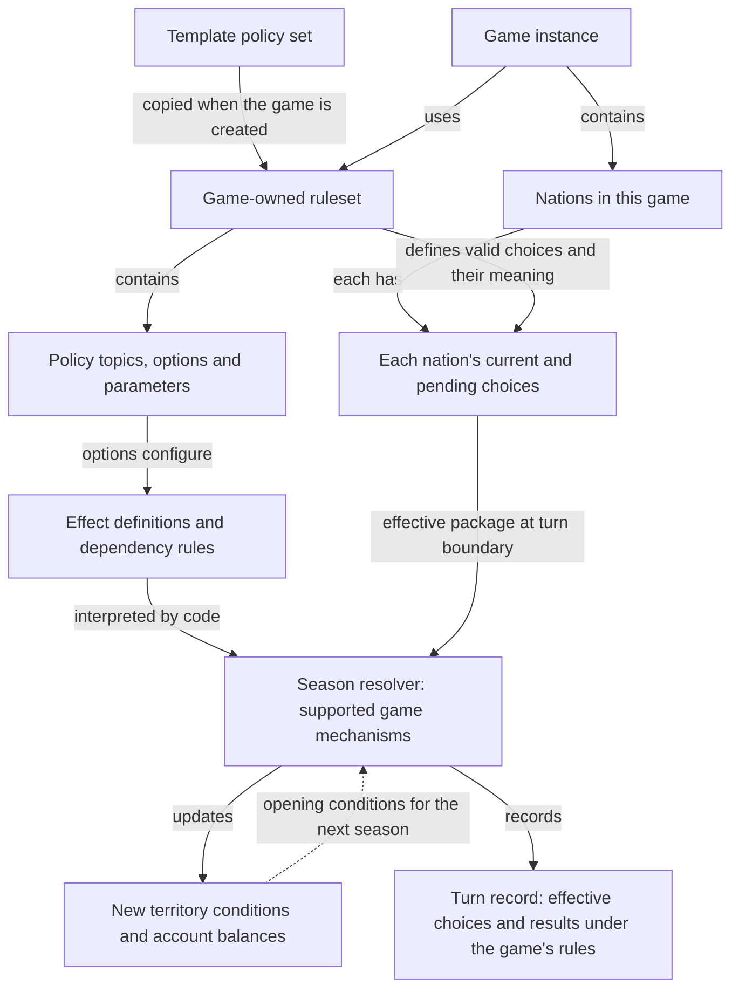
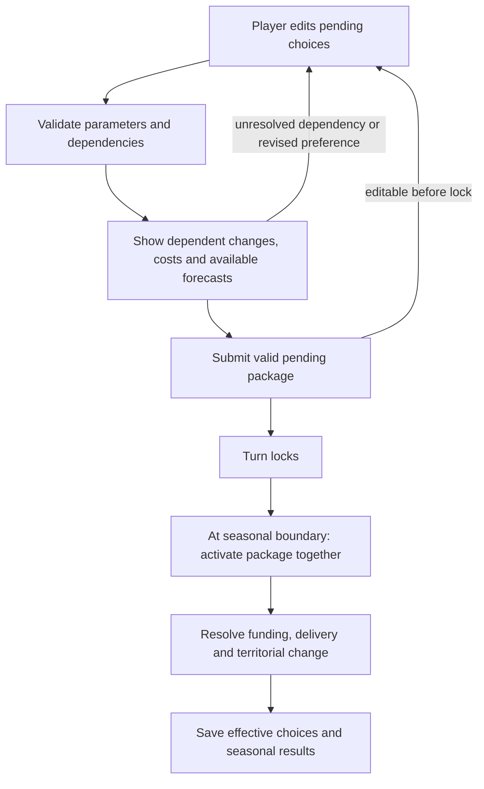

# Policy system — the big picture

Date: 2026-09-27.

Status: accepted conceptual structure based on the [foundation](policy-system-foundation.md). Boxes describe responsibilities and relationships. The user subsequently authorized the [first backend implementation](policy-system-first-pass.md); economic outcomes shown here remain the destination for later work.

Next level of detail: [schema draft with tables, example records and turn/rollback behavior](policy-system-schema.md).

## 1. Rules, national choices and results

The template supplies a starting copy. It is not consulted for mutable defaults during the game. Two games created from the same template own independent rule data; later template edits affect neither game.

All nations in one game use its common ruleset. They select different policies within that ruleset. A nation does not normally receive its own editable copy of policy definitions.

The ruleset defines what can be selected and what those selections mean. National choices record what each government has selected. The resolver combines effective choices with existing population, geography, development, accounts and other relevant state to calculate what actually happens.

The engine box represents several cooperating systems, not one enormous function. Policy definitions configure supported behavior; they do not contain arbitrary executable simulation code.

## 2. How this maps toward database structure

These are candidate record groups; exact table splitting remains open.

| Record group | Stores | Does not stand for |
| --- | --- | --- |
| Templates | Reusable starting rule collections and provenance | A live source of changes for existing games |
| Game rulesets | The game's independent policy definitions and balance settings | Current choices for a particular nation |
| Policy topics and options | Stable semantic identities, generic labels, defaults, permitted parameter values | Actual development or spending |
| Effects and policy rules | Supported effect type, validated arguments, prerequisites, incompatibilities and other supported conditions | Unrestricted formulas or arbitrary database-column writes |
| Nation policy state | Current choices, editable pending package and selected parameter values | A modified shared definition of a policy |
| Turn records and policy history | Effective choices, decision changes, realized flows and retained results under the game's rules | Copies of the complete policy catalogue each season |

“Game-owned” means separate records belonging to a game's ruleset. These records can live in the same physical tables as other games' records. It does not mean generating tables named after each game.

The game catalogue is **not copied every turn**. A turn operates under the game's definitions and records choices/results. Ordinary national policy changes select existing options; they do not duplicate the definitions.

Normal games keep their definitions isolated from template changes. ADMIN can directly change a test game's definitions; clean migration, immutable per-edit versions and exact historical replay of experimental rules are not V1 requirements.

The ADMIN testing path has **no impact preview**. Apply definition changes, rebuild effective policies for the test game's nations and recalculate as needed; undo/retry seasons to examine behavior. This rough workflow is intentionally limited to testing. The [testing clarification](policy-system-foundation.md#no-catalogue-copies-per-turn-a-direct-testing-workflow) supersedes the earlier elaborate revision proposal. Future UI effort should focus on viewing/editing policy sets.

Stable semantic identifiers help compare cloned rulesets. Database ownership/references distinguish each game's definitions. Player-facing labels are not identifiers.

## 3. What happens when the player changes a policy

This preview workflow is for a nation choosing policies under its game's definitions. ADMIN editing those definitions does not use this workflow.

Previewing does not enact the package or spend money. Pending packages must remain valid against the applicable ruleset when the turn is locked/resolved; a displayed estimate does not reserve or guarantee future funding. The precise validation/locking transaction is an implementation detail still to specify.

Policies become effective together at the seasonal boundary. Their outcomes may take several seasons. A new public-investment choice can be effective immediately for that season's decisions while its construction remains unfinished.

If an institutional change invalidates another policy, the interface shows the dependent change before submission. If there is no obvious valid replacement, the player resolves the choice before submitting a valid package. No extra political-consent simulation is implied.

## 4. A concrete walk through the boxes

Illustrative future healthcare example, not additional first-slice implementation scope:

1. A template offers a healthcare coverage topic with a universal option. That option defines an intended service entitlement and its supported effects.
2. A game receives an independent copy of that definition.
3. Nation A selects universal coverage and 100% of the calculated funding requirement. Nation B selects universal coverage and 0% funding.
4. Both nations have selected the same coverage option under the same game rules. Their funding decisions differ.
5. The resolver calculates affordable funding and feasible service delivery. Nation B receives no new funded service contribution from its zero-funded program. Nation A's funding choice still does not guarantee full delivery if money, capacity or inputs are insufficient.
6. Each nation's turn record retains its effective decisions and actual spending/delivery; local conditions evolve accordingly.

An edit to the template's coverage option cannot rewrite this game or these turn records.

## 5. Future national terminology

Future terminology overrides sit at the presentation boundary: a stable concept can be displayed as “Presidential Decree” in one nation and “Royal Proclamation” in another. They do not alter policy IDs, effects, permissions or financial results. Generic labels are used initially; the naming editor and its persistence structure remain deferred.

The first implementation only needs enough policy topics and supported effects to complete the small seasonal loop. Additional health, education, resource and trade systems can consume the same policy structure when their mechanisms exist.
