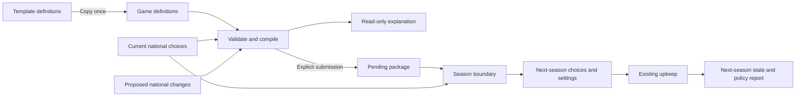

# Policy foundation — first implementation

**2026-09-28 update:** [The first playable seasonal economy](seasonal-economy-first-playable.md) now consumes tax, funding and infrastructure-priority effects and provides Budget & Policies with indicator previews. New games install its starter catalogue automatically. The original backend-only delivery below is historical; old saves are not a compatibility requirement. Visual catalogue administration remains deferred.

2026-09-27. Implements the agreed machinery in [the schema](policy-system-schema.md) and [foundation](policy-system-foundation.md). This is a backend pass, with HTTP APIs and command-line authoring. The player screen and visual catalogue editor remain next steps.

Development installation: the additive migration has been applied and example template **#1** created. No existing game was attached or opted into definition testing. Template IDs are installation-specific.

Follow-up: the [economic season dry run](economy-season-dry-run.md) captures subsequent accepted gameplay decisions and tests the proposed financial sequence independently. The infrastructure-priority topic, tax collection, debt, local development, informality and desertion described there are **not implemented by this backend pass** and have not been added to template #1.

## What works

- Eight relational tables store templates/game-owned definitions, conditions, effects, parameters, current choices and pending packages.
- Creating a game with a template copies active definitions once, remapping references. Subsequent template edits cannot change that game. Existing games without a selected set continue using their current economy.
- Founding materializes defaults. Each nation's parameters are stored explicitly; editing a default does not rewrite them.
- Player proposals validate against the complete resulting package. Preview explains dependency failures and suggests default replacements; submission requires the player to include those changes explicitly.
- Next-season choices for **all nations** are prepared before upkeep. Definitions are never copied per turn. Pending rows remain on their submitting turn; the next turn has none.
- Rollback deletes the destination choices/report and reopens the previous pending package. Test definition edits survive. Newly introduced inputs receive defaults on the reopened turn.
- Template edits and permitted test-game edits use the same structural validation. Test edits recompile every nation's current settings, preserve usable selections, and report incompatible selections. They do not replay spending or development.
- Game deletion explicitly removes choice and condition references before definitions. Source provenance can become null without deleting a surviving clone.



The next-season policy context is passed into national upkeep, with its settings stored in the destination report. **Existing resource/economic formulas do not consume these new settings yet.** This boundary is where their future replacements will connect.

## Four configuration examples

[The current starter document](../../database/policy-templates/economy.json) provides the supported production economy policies. The original ownership/priority dependency example is now a test fixture using supported effects, in `tests/client/fixtures/policy-dependencies.json`; its old placeholder handlers are retired.

Registered contracts are implemented by [PolicyEffectRegistry](../../app/Services/Policies/PolicyEffectRegistry.php):

| Effect | Compiled setting | Economic implementation |
| --- | --- | --- |
| `finance.income_tax` | Taxable-income rate | Tax base and collection pending |
| `budget.program_funding` | Infrastructure funding ratio | Program requirement, spending and growth pending |
| `institutions.ownership_arrangement` | Private / mixed / public industry | Investment and ownership consequences pending |
| `allocation.public_industry_priority` | None / consumer goods / military | Allocation consequences pending |

Neutral settings are rebuilt from scratch each time. Zero funding requests zero funded contribution; no infrastructure is erased. These examples do not change existing resource stocks, production, military costs or population. API responses explicitly expose `economic_consumers_available: false`; player explanations return `indicator_forecast: null` until there is a simulation to estimate.

## Authoring and trying it

Use PHP 8.3, matching the existing application's typed constants. Apply the new migration through the normal deployment process. Do not use `migrate:fresh` on the application database.

```bash
php8.3 artisan migrate --path=database/migrations/2026_09_27_000000_create_policy_foundation.php
php8.3 artisan app:policies create --file=database/policy-templates/economy.json
php8.3 artisan app:policies list
```

The create result includes the template ID. A new game can receive `policy_template_id` through `POST /client/admin/api/games`; the model entry point is `Game::createNew($map, policyTemplateId: $id)`. Omitting the template leaves policies unconfigured. There is no automatic retrofit of existing matches.

For a deliberately selected existing test game, using actual IDs in place of the placeholders:

```bash
php8.3 artisan app:policies testing GAME_ID --enabled=1
php8.3 artisan app:policies attach TEMPLATE_ID --game=GAME_ID
php8.3 artisan app:policies export GAME_SET_ID > /tmp/game-policies.json
# Edit /tmp/game-policies.json, then use the edit_counter shown by list:
php8.3 artisan app:policies import GAME_SET_ID --counter=1 --file=/tmp/game-policies.json
php8.3 artisan app:policies clone GAME_SET_ID --name="Another balance template"
```

Import is a complete catalogue replacement by stable keys, preserving existing policy/option IDs. Include unchanged records. Omitted used/active definitions are retired; unreferenced draft content can be removed. Parameter/effect/condition child records are rewritten as definition data, never per season. Renaming a semantic key is removal plus creation, not a label change.

Decimals are JSON **strings**, with at most six fractional places; integers and booleans use their JSON types. Bounds and steps use decimal strings. Ratio parameter units must match their effect contract (`fraction_of_taxable_income` or `fraction_of_program_requirement`). No executable expressions are accepted. An English label/message is required, with other locale entries optional.

## HTTP contract

All admin endpoints require an authenticated administrator and the existing development-only admin boundary. Writes retain CSRF protection. Player endpoints use the selected game and derive nation ownership from the authenticated user; callers cannot specify a different nation.

| Endpoint | Purpose |
| --- | --- |
| `GET /client/admin/api/policy-sets` | Catalogue list and supported effect contracts |
| `POST /client/admin/api/policy-sets` | Create template from `{document}` |
| `GET /client/admin/api/policy-sets/{set}` | Metadata, exportable document and remapped IDs |
| `PUT /client/admin/api/policy-sets/{set}` | Replace document using `{edit_counter, document}` |
| `POST /client/admin/api/policy-sets/{set}/clone` | Clone definitions to a template; optional `{name}` |
| `GET /client/admin/api/games/{game}/policies` | Inspect game catalogue and test-edit flag |
| `POST /client/admin/api/games/{game}/policies` | Set `{context_revision, testing_enabled}`; optional `template_id` attaches once to an existing test game |
| `POST /client/admin/api/games/{game}/policies/nations/{nation}/reset` | Explicit test repair of current choices; requires `turn_id`, `context_revision`, `edit_counter`, `changes`; clears that nation's pending package |
| `GET /nation/policies` | Own current/pending choices, catalogue, settings and report |
| `POST /nation/policies/preview` | Read-only package validation and direct settings |
| `PUT /nation/policies/pending` | Replace the complete pending package |

Player preview/submission body:

```json
{
  "turn_id": 123,
  "edit_counter": 1,
  "client_context": {
    "game_id": 7,
    "nation_id": 12,
    "user_id": 9,
    "turn_number": 4,
    "turn_context_revision": "CURRENT-UUID-FROM-GAMEPLAY"
  },
  "changes": {
    "income_tax": {"option": "standard", "parameters": {"rate": "0.25"}}
  }
}
```

`changes` contains complete desired values for each changed topic. It replaces all pending changes, rather than merging with a previously submitted package. Empty `changes` cancels pending changes. Include any dependent replacements shown by preview. Old turns, reset contexts and stale definition counters are rejected.

Test edits that add parameters initialize current choices, but an old pending package may still need resubmission with the new inputs. Removed parameters or retired selected options may require explicit test reselection. Diagnostics identify those cases; there is no migration of historical choices or archive of earlier rule definitions.

## Verification

The guarded [engine test](../../tests/client/policy-foundation.php) passed 72 assertions covering real MariaDB migrations, game/nation creation, cloning, typed validation, dependency proposals, preview purity, pending replacement, all-nation preparation before upkeep, injected upkeep failure, actual turn/rollback/retry, direct test edits, retirement and deletion. [HTTP tests](../../tests/client/policy-http.mjs) passed authentication, CSRF, admin authorization, cross-nation scope, stale contexts/counters and edit gates. The [migration rehearsal](../../tests/client/policy-migration.php) passed populated-game cleanup, surviving clones, down/up preservation of existing gameplay records, database ownership constraints and turn/rollback with populated games that have no policy set. Existing generated-client contracts and changed PHP syntax checks also passed.

Use the existing isolated bootstrap, a disposable `/tmp/no7-entry-db-*` socket-only MariaDB database named `no7_entry_test`, and the fixture server on loopback port 8792:

```bash
NO7_ENTRY_TEST_ROOT=/tmp/no7-entry-db-EXAMPLE php8.3 tests/client/policy-foundation.php
NO7_ENTRY_TEST_ROOT=/tmp/no7-entry-db-EXAMPLE php8.3 -S 127.0.0.1:8792 tests/client/map-beta-server.php
NO7_ENTRY_TEST_ROOT=/tmp/no7-entry-db-EXAMPLE node tests/client/policy-http.mjs
# After the HTTP run; consumes the synthetic policy fixture and rehearses down/up:
NO7_ENTRY_TEST_ROOT=/tmp/no7-entry-db-EXAMPLE php8.3 tests/client/policy-migration.php
```

The scripts create synthetic games/users only in that isolated database. No resource/economic rewrite, policy screen, indicator forecast, province law system or full historical NO2 catalogue is included in this pass.
