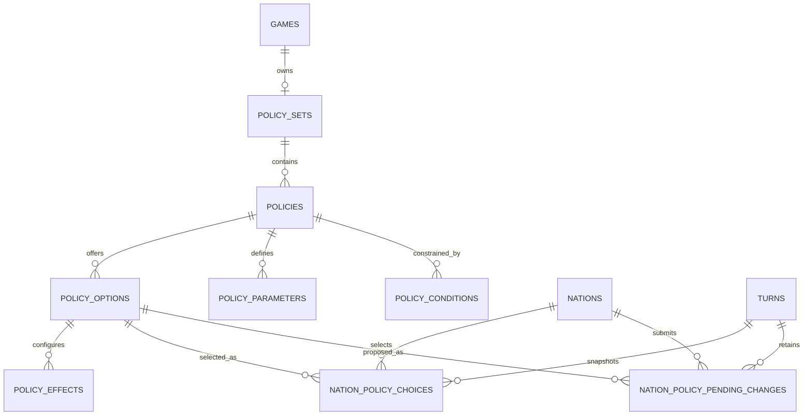

# Policy system — database schema draft

Date: 2026-09-27. Status: approved; the [first backend pass](policy-system-first-pass.md) now implements this foundation. The original schema rationale and examples are retained below.

The user approved the high-level structure and delegated schema details. This draft follows the [accepted foundation](policy-system-foundation.md), including the deliberately simple ADMIN test-edit workflow. [Example records](data/policy-schema-examples.json) illustrate the design; they are not a runtime import format or production balance settings.

## 1. The decision in one page

Use **eight new tables**: six for definitions and two for national choices. Add one small result-summary field to the existing per-turn nation record and one test-edit flag to the game. Reuse the existing games, nations and turns.

| Table | Plain-language responsibility | Copied each turn? |
| --- | --- | --- |
| `policy_sets` | A reusable template or a game's independent collection of definitions | No |
| `policies` | Questions the government can answer | No |
| `policy_options` | Available answers | No |
| `policy_parameters` | Typed inputs such as a tax rate or funding ratio | No |
| `policy_effects` | Supported mechanisms configured by each answer | No |
| `policy_conditions` | Prerequisites and incompatibilities | No |
| `nation_policy_choices` | The effective answers/values associated with a nation's turn | Small selection snapshot only |
| `nation_policy_pending_changes` | Changed answers/values submitted during a turn | No; retained on the submitting turn |

Definitions are copied once when creating a game from a template. Each season stores only selected option references and input values. There is no per-season copy of policy text, effect definitions or dependencies, no event-sourcing framework, and no immutable history of ADMIN definition edits.

Templates are `policy_sets` without a game owner. Game sets have exactly one game owner; a policy-enabled game has exactly one set. The diagram omits secondary foreign keys to keep it readable; ownership checks below are part of the design.

## 2. Definition tables

All eight tables have a bigint primary key `id` and ordinary `created_at` / `updated_at` timestamps. References use the same ID type as the existing application. Field types below describe intent; database-specific migration syntax is not part of this draft.

### `policy_sets`

| Field | Type / purpose |
| --- | --- |
| `kind` | Controlled string: `template` or `game` |
| `game_id` | Nullable FK → games; UNIQUE when present |
| `source_policy_set_id` | Nullable FK → policy_sets, provenance only; set null if source removed |
| `name` | Human-readable name |
| `description` | Nullable text |
| `edit_counter` | Positive integer, initially 1; increment on definition edits for cache/preview invalidation |

`kind = game` requires a game ID; `kind = template` requires no game ID. The application validates this invariant and the migration should enforce it where supported. No additional `games.policy_set_id` is needed: look up the unique set by `game_id`.

The edit counter is a freshness stamp, **not an archived version**. It does not create extra definition rows. Template provenance never supplies live fallback values. A clone receives fresh row IDs, keeps stable semantic keys and remaps internal references.

### `policies`

| Field | Type / purpose |
| --- | --- |
| `policy_set_id` | FK → policy_sets |
| `key` | Stable machine key, unique within the set; e.g. `income_tax` |
| `category_key` | Simple presentation group, e.g. `economy`; not a dependency or hierarchy |
| `labels`, `descriptions` | Locale-keyed JSON content; required generic label, optional descriptions |
| `sort_order` | Integer for presentation |
| `status` | Controlled string: `draft`, `active`, `retired` |

UNIQUE (`policy_set_id`, `key`). Keys stay stable when labels change. The initial scope is national; do not add unused province/zone polymorphic IDs now. Future local selections can extend the choice model deliberately without changing what a policy definition is.

### `policy_options`

| Field | Type / purpose |
| --- | --- |
| `policy_id` | FK → policies |
| `key` | Stable option key, unique within its policy |
| `labels`, `descriptions` | Locale-keyed JSON content |
| `is_default` | Boolean |
| `sort_order` | Integer |
| `retired_at` | Nullable timestamp; retired choices unavailable for new selection |

UNIQUE (`policy_id`, `key`). Every active policy has exactly one non-retired default. Enforce that cross-row rule in the authoring service transaction; do not rely on a boolean UNIQUE index.

Each nation selects **one option per policy** in V1. An independent law uses `disabled` / `enabled`. Several independent freedoms are separate topics grouped in the same category. A numeric policy can have a single automatically selected option (`standard`) and a visible parameter input; the player need not see a meaningless one-item dropdown. Multi-select collections and reform-package tables are not needed for the first slice.

### `policy_parameters`

| Field | Type / purpose |
| --- | --- |
| `policy_id` | FK → policies |
| `key` | Input name, unique within policy; e.g. `rate` |
| `labels` | Locale-keyed JSON content |
| `value_type` | Initially `decimal`, `integer` or `boolean` |
| `unit_key` | Supported semantic unit, e.g. `fraction_of_taxable_income` |
| `default_value` | JSON scalar matching the declared type |
| `min_value`, `max_value`, `step` | Nullable fixed decimal bounds/increment; used for numeric inputs |
| `sort_order` | Integer |

UNIQUE (`policy_id`, `key`). All declared inputs have defaults and are stored explicitly in a nation's choice; missing values are not repeatedly read from mutable definition defaults. Parameters belong to the topic, so switching options can retain a funding value while `disabled` has no funding effect.

Canonical decimal input values are decimal strings such as `"0.20"`, parsed and validated as decimals. Bounds/steps use fixed decimal columns, proposed precision `(20,6)`. Fractions use 0–1 storage; the UI can show percentages. Integer and boolean values remain JSON integers/booleans. Money arithmetic must use the eventual finance system's fixed units; this table does not define a floating-point ledger.

### `policy_effects`

| Field | Type / purpose |
| --- | --- |
| `policy_option_id` | FK → policy_options |
| `key` | Stable row key within the option, e.g. `tax_rule` |
| `effect_type` | Registered code handler key |
| `arguments` | Validated JSON object of literal values and explicit parameter bindings |
| `sort_order` | Presentation order only; must not decide which conflicting effect wins |

UNIQUE (`policy_option_id`, `key`). Every effect belongs to an option. Repeating a small effect definition on several options is preferable to a second inheritance/template system in V1.

Example arguments: `{"rate":{"parameter":"rate"}}` binds the selected topic parameter. `{"program":"infrastructure"}` supplies a literal allowed by that effect type. Bindings can only reference declared parameters on the same policy. No expressions, arbitrary property paths, SQL or PHP are accepted.

The code registry supplies argument schemas, compatible parameter types/units, direct meaning, target interpretation, combination rules and consumers. There is no database table of executable effect implementations. A new policy composes known effect types; a new causal mechanism requires code.

Rebuilding effective settings starts from neutral engine defaults and the currently selected active effects. It must not repeatedly add yesterday's modifiers or execute payments. Finance and development realize flows once during resolution. Conflicting exclusive settings are validation errors; supported multipliers, contributions and funding commitments combine according to their registered semantics, not row order. Definition-time checks catch unconditional collisions; complete nation-package validation catches collisions that depend on selected options.

### `policy_conditions`

| Field | Type / purpose |
| --- | --- |
| `policy_id` | FK → policies; owner of the restriction |
| `policy_option_id` | Nullable FK → policy_options; null applies to the topic, otherwise to that option |
| `key` | Stable rule key within the owning policy |
| `condition_type` | Initially `requires_option` or `excludes_option` |
| `referenced_policy_id` | FK → another policy in the same set |
| `arguments` | JSON, initially `{"option_keys":["mixed","public"]}` |
| `message` | Locale-keyed explanation shown to the player |

UNIQUE (`policy_id`, `key`); index `referenced_policy_id` for finding affected dependents. Option membership and same-set references are validated when authoring/cloning. Stable option keys inside arguments must exist on the referenced policy; they are not opaque unchecked strings.

`requires_option` means the referenced policy selects any listed option; `excludes_option` means it selects none of them. Multiple conditions are ANDed. No generic expression tree in V1. Numeric bounds live on parameters. A topic-wide condition requires a dependent topic's non-default choices to be applicable; its default is the explicit neutral/inactive fallback. The editor must require a no-effect default for such a topic. Option-specific conditions can express most initial cases without disabling the entire topic.

Validate against the **complete prospective national package**, including changes made together. Reject dependency cycles in the initial authoring model rather than introducing a recursive rule solver. Defaults must form a valid starting package. If a proposed change invalidates another selection, suggest its valid default and show that consequence before submission; require an explicit valid choice if no fallback is valid. Re-run validation for all affected dependents. Do not silently repair choices after submission.

## 3. Choice and turn data

### `nation_policy_choices`

| Field | Type / purpose |
| --- | --- |
| `game_id`, `nation_id`, `turn_id` | FKs → existing games, nations, turns |
| `policy_id`, `policy_option_id` | FKs → the game's definitions |
| `parameter_values` | JSON object keyed by declared parameter keys; all inputs explicit |

UNIQUE (`nation_id`, `turn_id`, `policy_id`); index (`game_id`, `turn_id`). One row per active topic per nation per turn. A boolean option or numeric value is tiny compared with the shared definition it references. This table is both the effective state and the selection history; no separate policy-change event store is required.

### `nation_policy_pending_changes`

Same fields and uniqueness/index rules as `nation_policy_choices`. Its `turn_id` is the **submitting turn**, not the future turn. Store only changed topics, but store the complete desired option/parameter object for each changed topic—not an incremental numeric patch.

Deleting a pending row cancels that proposed change; it does not repeal the effective policy. Repeal is selecting an explicit `disabled`/neutral option. A saved package equal to effective choices needs no pending rows. Submission replaces the nation's complete pending package atomically under the existing game mutation lock, after validating it together with unchanged effective choices. Include the existing turn context and ruleset edit counter in stale-submission checks.

All policy writes verify: the nation and turn belong to `game_id`; the policy belongs to that game's set; the option belongs to that policy; parameter names/types/ranges are valid. Conventional foreign keys plus these explicit ownership checks fit current repository patterns. Database foreign keys alone do not establish all these cross-row relationships.

### Small additions to existing tables

- `games.policy_testing_enabled`: boolean, false by default. Existing admin authorization plus this flag allows direct edits of game-owned definitions; active normal matches keep stable definitions. Template authoring is separate. This is a narrow test-edit gate, not a new game-mode framework.
- `nation_details.policy_report`: nullable JSON, generated for the newly resolved turn. Contains a bounded explanation summary: changed topic keys/from/to choices, direct effective settings worth reporting, and realized program outcomes supplied by the responsible systems. It is not the treasury ledger or a duplicate of all territorial state. Recompute/replace it each season rather than inheriting the previous report unchanged.

Store actual financial/population/development results in the corresponding turn-state models as those systems are implemented. This schema intentionally does not define the entire new economy's tables. Comparing choice snapshots supplies change history; the report supplies why realized outcomes differed from the government's promise. Initial founding can use a null report.

## 4. Exact seasonal and rollback contract

The current code creates a next turn, runs nation/territory/division resolution, then activates it. Rollback deletes the latest turn and relies on cascading deletes before resetting the previous one. Policy integration should follow that structure, with an explicit policy-resolution step before economic consumers read effective policy settings.

Example, from turn 4 to turn 5:

1. Turn 4 holds effective choices `C4` and an editable submitted package `P4`. A player preview evaluates `C4 + P4` without writing state.
2. At the boundary, lock and validate the full package for every nation. Construct `C5 = C4 with P4 replacements` for **all nations before** policy-dependent resolution.
3. Create choice rows for turn 5. Run the upcoming seasonal calculation from turn-4 world state using `C5`; store new world/account state and reports on turn 5. Consumers must receive this effective policy context explicitly—merely copying rows will not update existing methods that read current-turn state.
4. Leave `C4` and `P4` intact on the ended turn. Turn 5 begins with `C5` and no pending rows. Historical `P4` is retained input, not another live queue.
5. Undo turn 5: its choices, pending edits, reports and state are deleted with that turn. Turn 4 reopens with `C4` and the submitted `P4`, ready to adjust or retry. ADMIN edits to game-owned definitions survive because they are not turn-owned.

This timing means a submitted change takes effect in the resolution that produces the next turn, rather than waiting an extra season. All nations' effective configurations are determined before interacting systems run. Current choices remain unchanged while the player edits pending choices.

Use the existing `GameMutation` transaction/lock boundary so failed resolution does not leave half a package or partially applied state. Keep reports on the destination turn so rollback removes them naturally. Exact reproduction of random outcomes after a retry is not promised.

## 5. Copying, editing and removing definitions

**Create from template:** validate a coherent active catalogue; create its game-owned set and active definition rows; remap policy, option and dependency IDs in one transaction. Preserve semantic keys, copy JSON by value, and materialize starting national choices from valid defaults/founding selections. Draft and retired authoring content is not copied into a normal game's active catalogue. A required reference to excluded content makes the template invalid for game creation.

**Clone for authoring:** the same copying mechanism can clone a set into another template. It copies definitions, not nations' choices, accounts or turn history. There is no runtime inheritance from the original set.

**ADMIN test edits:** save structurally valid definitions directly, increment `edit_counter`, and invalidate/rebuild derived policy settings for that game. There is no impact preview, publication workflow or immutable per-edit revision. Preserve existing national selections; when edits make them structurally unusable, identify the affected selection for an admin reset/reselection instead of inventing a migration. Economic harm is not a validation failure. Recompiling settings does not move population, spend money or replay an elapsed season.

**Remove:** hard-delete unreferenced draft content. Definitions referenced by choices/history are retired rather than physically removed. A retired topic contributes no active effects. A retired option cannot be newly selected; an existing selection of it requires reset/reselection in a test game, and affected resolution must identify that problem rather than dereference missing data. This is simple referential integrity, not a clean test-game migration system. Normal game definitions are not edited this way.

**New test topics/parameters:** when preparing the current turn after an admin edit, explicitly initialize missing choices/inputs from valid defaults. Do not rewrite ended turns. After rollback, the reopened turn may need the same initialization. Already stored parameter values must not change merely because a definition default changed. Test history may no longer compare cleanly with edited definitions; that accepted limitation is not a reason to build a version archive.

**Deletion rules:** choices/pending rows cascade with their turn or nation. Definition references from choices/pending and conditions restrict accidental deletion. Child effect/parameter/rule rows can cascade when their unreferenced parent is removed. Complete game deletion should remove turn/nation state first, then delete the game's set and its internal condition references/definition children in a transaction; do not depend on an unverified cascade ordering through restrictive references. Template deletion clears provenance on surviving clones and does not delete their content.

## 6. Example records: four topics demonstrating three cases

The [JSON example](data/policy-schema-examples.json) shows game 42, policy set 20, nations 7 and 8, and submitting turn 4004. IDs are fictitious. Rows omit timestamps and some optional presentation fields for readability. The referenced template and existing game/nation/turn records are context stubs, not an executable seed.

| Topic | Options / input | Supported effect contract illustrated |
| --- | --- | --- |
| `income_tax` | Single `standard` option; `rate` defaults to `0.20` | `finance.income_tax`: establish a rate on a defined taxable-income base; actual collection is a finance-system flow |
| `infrastructure_funding` | `disabled` / `enabled`; `funding_ratio` defaults to `1.00` | `budget.program_funding`: request a fraction of a calculated program requirement; no automatic infrastructure points |
| `industrial_ownership` | `private` / `mixed` / `public` | `institutions.ownership_arrangement`: establish the chosen arrangement; not immediate free transfer of existing assets |
| `public_industrial_priority` | Neutral `none`, `consumer_goods`, `military` | `allocation.public_industry_priority`: prioritize eligible public activity; non-neutral choices require mixed/public ownership |

The [first backend pass](policy-system-first-pass.md) now registers these contracts as validated, compiled settings. Their economic consumers remain unimplemented. These examples test the schema's expressiveness; they do not expand the first playable slice to implement full industrial investment or trade.

Nation 7 has tax `0.20`, infrastructure funding `0.80`, mixed ownership and consumer-goods priority. Nation 8 has tax `0.10`, infrastructure funding `0.00`, private ownership and neutral priority. Both use the same definitions. Funding zero yields no new funded infrastructure contribution, without deleting existing infrastructure.

Nation 7's pending package changes tax to `0.25` and ownership to private, and explicitly includes the dependent priority change to `none`. The player sees that dependent change before submission. The example turn-5 selection snapshot therefore contains four choices: new tax, unchanged funding, private ownership and neutral priority. No policy definition is copied or edited by this package.

## 7. Keeping the system extensible without building everything now

- **Resources:** effect handlers may later accept validated resource targets and produce input requirements. Parameter JSON is not a substitute for inventory/transaction tables.
- **Provinces/zones:** add explicit area assignments and scoped choices when implementing that feature. National scope is implicit in V1; avoid nullable polymorphic scope columns whose overlap rules are not yet defined.
- **Roleplay naming:** future nation terminology maps reference stable semantic keys. Existing generic locale labels remain separate from rules. No terminology override table yet.
- **Additional effects/conditions:** add registered handlers and schemas, not executable strings. More complex rules require a justified extension; do not build a general expression engine now.
- **Difficulty/templates:** clone and adjust definitions. Global simulation parameters outside policy effects need their own deliberate configuration when required; do not disguise every engine constant as a policy.
- **Viewing/editing UI:** the relational catalogue supports listings, dependent-choice inspection and effect editors. JSON is limited to locale content, validated argument shapes, input values and compact outcome reports. There is no giant JSON blob containing the whole policy system.

## 8. Evidence and review checks

Current integration anchors: [Game::tryNextTurn / rollbackLastTurn](../../app/Models/Game.php), [Turn](../../app/Models/Turn.php), [ReplicatesForTurns](../../app/ModelTraits/ReplicatesForTurns.php), [Nation](../../app/Models/Nation.php), [NationDetail](../../app/Models/NationDetail.php), [GameMutation](../../app/Services/GameMutation.php), [nation_details migration](../../database/migrations/0001_01_01_000007_create_nation_details_table.php), and [production_bids migration](../../database/migrations/0001_01_01_000023_create_production_bids_table.php).

Before implementation, review this schema against the following behaviors: clone isolation; one selected option per topic; valid defaults; parameter type/unit validation; dependency correction in one pending package; no catalogue copy on turn advance; retained submitted package after rollback; definition edits surviving rollback; no preview writes; rebuilds without additive stacking or duplicate payments; and a clear diagnostic for incompatible test edits.

The sample records verify relationships and the turn-choice overlay without executing the game. Runtime verification and the executable authoring format are documented in the [first-pass handoff](policy-system-first-pass.md). Economic formulas and UI design remain subsequent work.

Draft validation completed: checked sample unique keys, definition/choice references, defaults, parameter bindings and numeric bounds; verified the expected turn-4-to-5 choice overlay; confirmed that omitting the dependent priority change makes the proposed package invalid. Document links and formatting were checked. These are static design/example checks, not database migrations or runtime tests.
