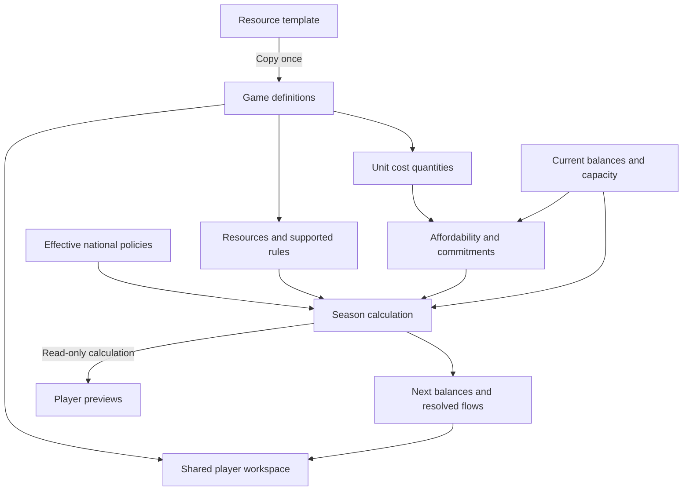

# Resource foundation — schema and runtime contract

2026-09-29 extension: [production/development Package B](production-state-contract.md) adds owner-scoped inventory/cost basis, productive capacity, civilian cash, acquisition intent and production economics rules. The original schema below describes the earlier foundation; consult that extension for the new storage boundary.

Date: 2026-09-28. Status: original design draft, now implemented by Package A on isolated fresh games. See [implementation details and deviations](resource-system-first-pass.md). Live migration and fresh-game rollout remain pending. The user approved the four-step replacement direction and delegated the foundation work. Cleanup and passive AI are separate implementation tasks. This document makes concrete recommendations within that direction; it does not claim approval of every schema detail.

Basis: [resource audit](resource-system-audit.md), [seasonal economy](seasonal-economy-first-playable.md), and the existing game-owned policy catalogue. The objective is a working method using today's resources, not a new balancing exercise.

## 1. Decisions for the first implementation

- One game-owned catalogue. Four definition tables; reuse existing seasonal state tables where their purpose still fits.
- The initial entries are money, recruitment, food, raw materials, ore and oil. Stable keys are `money`, `recruitment`, `food`, `material`, `ore`, `oil`. These are seed data, not a new resource enum. No aliases for old enum names or numbers.
- Three supported kinds: `currency`, `stock`, `capacity`. Each has explicit accounting behavior. Future services/recipes are extensions, not empty systems implemented now.
- Exactly one definition supplies each required role: `treasury`, `nutrition`, `recruitment`. Consumers resolve roles once from the catalogue rather than comparing resource names. Other goods have no required role.
- Money has one spendable balance. It stays in the common seasonal balance table but only the fiscal system creates tax receipts, borrowing and repayments. Debt remains in national fiscal state; it is not a negative resource stock.
- Recruitment is non-stored capacity. Active and pending divisions occupy it. It is never manufactured, granted or accumulated each season.
- Game-specific production mappings, demand parameters and unit costs reference the catalogue. Adding a supported good and binding it to an existing production/cost mechanism requires definition changes, not editing lists in PHP/JS.
- Definitions are cloned at game creation only. Seasons snapshot quantities, selections and outcomes. Rollback remains supported within new games.
- One replacement runtime, fresh games. No old-save conversion, enum adapter, old/new resource switch or dual writes.

## 2. Definitions: four tables

All definition tables have ordinary IDs and timestamps. JSON stores bounded configuration/content, never executable formulas, SQL or PHP.

### `resource_sets`

| Field | Purpose |
| --- | --- |
| `kind` | `template` or `game` |
| `game_id` | Nullable game FK; unique when present, cascade on game deletion |
| `source_resource_set_id` | Nullable provenance FK; set null if source deleted |
| `name`, `description` | Author-facing identity |
| `edit_counter` | Integer concurrency token, initially 1 |

One set per game, matching the policy catalogue's ownership pattern. Do not introduce a universal ruleset framework or restructure all policy tables for this feature. New-game creation accepts a resource template alongside the policy template and clones both in its existing transaction. Both sets and `games.economy_rules` belong to the resulting game independently of later template edits.

### `resource_definitions`

| Field | Purpose |
| --- | --- |
| `resource_set_id` | FK to the owning set |
| `key` | Stable machine key, unique within the set |
| `kind` | Validated `currency`, `stock`, `capacity` |
| `role` | Nullable `treasury`, `nutrition`, `recruitment`; unique per set when present |
| `labels`, `descriptions`, `unit_labels` | Locale-keyed JSON; English fallback required |
| `icon_key` | Known bundled presentation asset; a generic fallback is allowed |
| `sort_order`, `display_decimals` | Presentation, not accounting precision |
| `starting_quantity` | Fixed decimal; zero for capacity |
| `grantable` | Boolean; false for capacity |

Constraints: UNIQUE `(resource_set_id, key)` and `(resource_set_id, role)`. Authoring validates role/kind compatibility: treasury→currency, nutrition→stock, recruitment→capacity. Only one currency is supported initially. The absence of a rule does not invent production or demand.

Do not duplicate `can_be_stocked`, `produced_by_labor` and several inverse flags in storage. Derive capabilities from kind and registered rules for the API. Keep `grantable` explicit because not every future stock must be transferable.

Keys and kinds are stable once a game has state. Labels and numeric tuning can change in an admin test game; structural removal/reclassification can use a fresh game. This is not an immutable versioning or historical conversion service.

### `resource_rules`

| Field | Purpose |
| --- | --- |
| `resource_id` | FK to the definition this rule concerns |
| `handler` | One registered implementation key |
| `parameters` | JSON validated by that handler |

UNIQUE `(resource_id, handler)`. Initial handlers:

| Handler | Allowed kind | Parameters and meaning |
| --- | --- | --- |
| `production.territorial_labor` | stock | Explicit terrain→yield map, automatic-demand priority and default extra-output priority. Produces this resource from the current territorial workforce. |
| `demand.population` | stock | Quantity per million residents and consumption priority. Initially used by food. |
| `capacity.loyal_population` | capacity | Capacity per million loyal residents. Initially used by recruitment. |

The registry defines units, valid ranges, phase, scope and allowed combinations. A producer and population demand may coexist on one resource. There is at most one producer per stock and one capacity provider per capacity in this pass. Required terrain entries are validated; unsupported handlers are errors, not ignored configuration.

Treasury settlement remains `EconomicSeason`/`EconomyService`, bound to the treasury role. It does not need a fake resource production rule. Nutrition's existing population-growth calculation resolves the nutrition role and its demand; we are not inventing starvation, migration or new unrest effects in this structural pass.

### `unit_resource_costs`

| Field | Purpose |
| --- | --- |
| `resource_id` | FK to the cost's resource, and therefore its game/template set |
| `division_type` | Current supported military type key; combat definitions remain in code |
| `phase` | `deployment`, `season`, `operation`, `active_capacity` |
| `quantity` | Fixed decimal requirement per division; positive |

UNIQUE `(resource_id, division_type, phase)`. A complete catalogue validates all supported unit types and their explicit cost maps; an empty operation map is valid, but missing/unresolved resource references are not silently dropped. Authoring a free deployment must be an explicit ruleset choice, not an accidental consequence of deleting a referenced resource.

For this pass: deployment/operation accept stock or currency; season uses currency for existing military funding; active_capacity accepts capacity only. General recurring goods inputs can be added with their fulfillment behavior later. Do not advertise unsupported seasonal goods consumption through a permissive schema.

Recruitment occupies active_capacity once per unit. A pending deployment reserves the additional capacity it will occupy; executing it transfers that reservation to active occupancy. It is not charged once for deployment and again as a consumed seasonal good. Disbanding releases occupancy; a population fall can leave existing occupancy above capacity without silently deleting units. Further recruitment is then unavailable.

Attack/Guard response multipliers remain order mechanics applied to the game's operation cost map. Costs are quantities, not prices. This draft adds no exchange rates or market price formula.

## 3. Seasonal state and references

Keep the existing table names where their responsibilities remain useful; replace old resource columns directly during the breaking release. There is no backfill from enum IDs.

| Existing table | Required change |
| --- | --- |
| `nation_resource_stockpiles` | Replace `resource_type` with `resource_id` FK; replace double quantity with DECIMAL(20,6); unique `(nation_id, turn_id, resource_id)`. Currency and stock only. |
| `labor_pool_facilities` | Reference the producing `resource_rule_id`; unique `(labor_pool_id, resource_rule_id)`. Only supported stock producers create these aggregate facilities. Store capacity/productivity with explicit units; no Capital or recruitment facilities. |
| `labor_pool_allocations` | Resolve resource through the facility; remove redundant `resource_type`. Unique allocation per facility. Integer workers remain distinct from goods units. |
| `production_bids` | Replace `resource_type` with `resource_id`; unique `(nation_id, turn_id, resource_id, bid_type)`. Retain automatic versus player-request allocation purpose. Remove the Capital catch-all bid. |
| `nation_offers` | Replace the tiny enum field/cast with nullable `resource_id` FK. Resource grants require it; non-resource offers do not. |
| `nation_details` | Add nullable `resource_report` JSON for the resolved season; keep debt/fiscal state and the existing financial report. |

Every write verifies that game, nation, turn, definition, rule and facility belong together, in the existing game mutation transaction. Ordinary FKs are not sufficient to establish same-game ownership. Definition deletion is restricted while referenced; game deletion removes dependent state before its definitions. Source-template deletion never cascades into a copied game.

`resource_report` contains resolved rows keyed by resource key/ID: opening quantity, output, committed action consumption, requested/fulfilled/unmet ongoing demand, closing quantity; capacity instead records capacity and occupied amount. Include reason categories needed to explain totals, not a per-worker or per-transaction event store. Reports store facts, never copies of descriptions/yield/cost definitions. Existing fiscal reporting remains the detailed currency ledger; the currency resource summary is derived from that result, not independently recomputed.

Between-turn grants modify the current balance. The next season's opening quantity is the balance at resolution, not a promise that it equals last season's closing report. Once historical turn snapshots close, their state/report is not rewritten by previews or later seasons.

## 4. Quantities and calculation ownership

Use six decimal places for goods and money. API/import quantities are canonical decimal strings, not arbitrary JSON floats or old labor-scaled numbers. Use bounded decimal arithmetic for debits, credits and affordability; `brick/math` is already present in the locked dependencies and can provide the shared quantity helper without introducing a new arithmetic framework. Promote it to an explicit dependency if directly used. Reject non-finite/negative inputs and values or aggregate results outside DECIMAL(20,6); do not silently clamp overflow.

Labor is integer workers. Productivity is goods per million workers per season, and a named conversion performs that calculation. Reusing one-million as the initial population unit does not make resource quantities labor units. Display rounding never governs affordability. Bound computed physical output down to six places, quantize a cost once under a documented rounding rule, and reuse that exact amount in preview/reservation/settlement. Transfers preserve the exact debit=credit identity.

Continuous development indicators can remain floating-point. Quantize their resulting monetary flows once before fiscal payment/accounting; resulting ledger identities must hold at the chosen precision. A DB decimal column alone is not enough if later arithmetic immediately converts it to floats.

Recommended responsibilities, extending existing services rather than introducing another engine framework:

- `ResourceCatalogue`: author/import/export/clone/load definitions; request/game scoped lookup by key or role; no per-resource queries inside allocation loops.
- `ResourceRuleRegistry`: validates supported rules and produces explicit calculation inputs. No arbitrary expression evaluator.
- `ResourceCosts`: resolves game-owned unit maps and committed requirements, shared by deployment, orders, Guard, grants and previews.
- `ResourceSeason`: pure physical-output/demand/capacity calculation. Reuse `ProductionAllocation` arithmetic after removing Capital assumptions. Persistence stays in existing turn orchestration.
- `EconomyService`: sole fiscal settlement, reading currency costs from ResourceCosts and writing the treasury-role balance once.

Current physical command affordability can include expected domestic production; money commitments use current uncommitted cash. Preserve that distinction explicitly for the first replacement. A saved production change must not make accepted action commitments unfundable under the authoritative forecast. At seasonal execution, revalidate physical action costs: an action that cannot be supplied is not executed for free, and its unspent commitments are released/reported. This is a correctness requirement, not a new credit or market system. Recurring civilian demand can be unmet and must be reported separately from actual consumption. The first pass retains existing food-growth behavior rather than adding new shortage penalties.

Use one authoritative resource calculation for seasonal resolution and server previews. The client may display immediate tentative input changes, but should consume the server result for multi-resource allocation/affordability. Extend the current preview/command lifecycle; do not maintain a second JS implementation of the old money fallback. The fiscal preview still uses the existing bounded income sensitivity estimate.

## 5. Current-resource seed, without rebalance

| Key | Kind / role | Founding quantity | Mechanism |
| --- | --- | --- | --- |
| money | currency / treasury | 20 | Fiscal receipts, expenses, credit and repayment |
| recruitment | capacity / recruitment | not stored | 1 capacity per million loyal residents |
| food | stock / nutrition | 0 | Territorial labor; demand 1 per million residents |
| material | stock | 0 | Territorial labor; no invented consumer |
| ore | stock | 10 | Territorial labor; some deployment requirements |
| oil | stock | 10 | Territorial labor; some operation requirements |

Initial labor yields, goods per million workers: Plain/River food 4 and other goods 1; Forest material 4 and food 2; Mountain ore 4 and food 2; Desert/Tundra oil 4 and food 2; other goods in those land terrains 1; Water all 0. The representative regional terrain remains the geographic input. No Map Lab deposit import or microcell economic expansion here.

Unit requirements copied from current quantities:

| Unit | Deployment | Seasonal money | Active recruitment capacity | Operation |
| --- | --- | --- | --- | --- |
| Infantry | money 3 | 1 | 1 | none |
| Armored | money 5, ore 5 | 1 | 1 | oil 1 |
| Artillery | money 4, ore 1 | 1 | 1 | none |
| Fighter | money 10, ore 1 | 1 | 1 | oil 1 |
| Bomber | money 15, ore 1 | 1 | 1 | oil 1 |

These tables specify initial content, not hardcoded universal requirements. A simpler template can remove optional goods and explicitly substitute its cost maps. The first engine still requires nutrition, treasury and recruitment roles; a game presenting only money and food can retain recruitment as an internal capacity entry. Completely removing recruitment mechanics is a later gameplay decision, not a catalogue toggle that silently breaks the military.

## 6. Authoring, references and player contract

Templates and game copies use DB definitions, with a small JSON import/export document for authoring and version control. Follow the existing policy tooling pattern; defer a visual resource editor. Export by keys, not database IDs. Import validates the whole document and resolves references transactionally. Cloning remaps IDs, including rules and costs, without sharing mutable definition rows.

Admin test edits use the existing test-game authority pattern and an edit counter; no preview guarantee or immutable edition history. Numeric/label edits invalidate derived allocations and forecasts before the next read/command. Changes to a starting quantity affect future founding, not existing cash. A rejected/incomplete definition document leaves the previous document intact. For key/kind/removal changes that invalidate state, recreate the test game rather than implementing conversion. Policy and resource definitions remain separate bounded catalogues, checked together at game creation when cross-references exist.

The shared player workspace supplies:

- catalogue identity/edit counter and definitions with keys, labels, kinds, roles and derived capabilities;
- per-resource current stock or capacity, commitments and authoritative availability;
- resource plans, unit cost maps and the last resolved resource report;
- the existing fiscal forecast and indicators with one explicit treasury meaning.

Commands submit resource keys and decimal quantities with current game/nation/turn context and the resource edit counter. The backend resolves those keys inside the selected game's set. Never accept an arbitrary resource ID from another game's catalogue. Drafts/previews are invalidated when the counter changes; stale command submissions receive a context conflict. No catalogue stored in localStorage and no second confirmed-data owner.

Production UI iterates supported producer capabilities. Grants iterate grantable stock/currency. Header and inspectors use definitions/roles rather than six-name lists. Empty optional groups hide cleanly. Rankings use the treasury binding. Public potential maps remain potential; private allocation and stocks remain private. Definitions used by those public views are public game rules, not a reason to expose national state.

## 7. Extension boundary

A future recipe is a new supported production mechanism with explicit input/output quantities and a settlement phase. A future service needs a flow/capacity and fulfillment mechanism. Neither is equivalent to adding a new stock row. The catalogue identity, rule registry, quantity contract and reports leave room for those additions without pretending they are already implemented.

State-owned commandable reserves are the only physical balance owner in this first pass. Later private supply and market demand need distinct ownership/accounting. Do not use national stocks as proof that the government owns a capitalist economy's entire supply. Resource prices, substitution, international markets, private companies and new ownership policies remain out of scope.

## 8. Work packages and delivery gate

See [the implementation handoff](resource-system-implementation-handoff.md) for bounded tasks and required removals. Step 1 is this draft. Step 2 implements the foundation and active callers. Step 3 separately completes legacy cleanup and passive AI. Step 4 creates fresh playtest games and verifies the single runtime.

Separating assignments saves work; it does not authorize shipping the new foundation with active old strategy code or compatibility bridges. Necessary changes to callers happen with the replacement; final deletion review and passive AI can be delegated later. Until those prerequisites are done, implementation is unfinished and should not be presented as ready for a mixed old/new live playtest.
